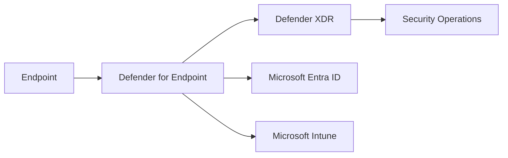

# Defender for Endpoint

## Executive Summary

Microsoft Defender for Endpoint provides endpoint detection, response, vulnerability management and attack surface reduction for enterprise endpoints.

In Microsoft 365 security programs, Defender for Endpoint is often the control plane that connects device risk, identity protection, Conditional Access and Security Operations Center response. It should be designed as part of the broader Zero Trust architecture, not as a standalone antivirus replacement.

## Business Scenario

Common scenarios include:

- Replacing legacy endpoint protection with cloud-managed EDR
- Detecting compromised endpoints before privileged access is allowed
- Reducing exposure through vulnerability and misconfiguration management
- Enforcing Conditional Access based on device risk
- Building incident response workflows across Defender XDR

For a regulated SaaS provider, endpoint risk visibility was used as a control input for administrator access. This reduced unmanaged endpoint exposure while keeping operations practical for engineering and support teams.

## Architecture

Key architecture decisions:

- Onboarding method: Intune, Group Policy, script or Defender for Cloud
- Device grouping: business unit, geography, server/client and privilege tier
- Role-based access: security reader, analyst, responder and administrator
- Integration: Intune compliance, Entra Conditional Access and Defender XDR
- Data retention and alert routing: aligned to SOC process

## Implementation

Recommended implementation flow:

1. Define endpoint scope and ownership.
2. Confirm licensing and Defender portal access.
3. Onboard pilot devices through Intune or script.
4. Validate sensor health, alert generation and device inventory.
5. Configure attack surface reduction and controlled folder access in audit mode first.
6. Review vulnerabilities and create remediation waves.
7. Connect device risk to Conditional Access after pilot validation.
8. Document operations, exception handling and escalation process.

## Licensing

Defender for Endpoint capabilities vary by license. Microsoft 365 E5 includes the broader endpoint security and XDR capabilities typically required for enterprise SOC use cases. Microsoft Defender for Business can fit smaller environments but should be checked against response, hunting and integration requirements.

## Security

Core security controls:

- Tamper protection
- Endpoint detection and response
- Attack surface reduction rules
- Web protection and network protection
- Vulnerability management
- Device risk integration with Conditional Access
- Automated investigation and response

## Best Practice

- Start ASR rules in audit mode and move to block mode through phased rings.
- Separate pilot, broad deployment and sensitive device groups.
- Align device groups with SOC triage ownership.
- Use Intune security baselines where possible, but document exceptions.
- Validate alerts with controlled test scenarios before executive reporting.

## Troubleshooting

- Sensor health missing: confirm onboarding package, service status and network connectivity.
- Device not appearing in Defender: check tenant association and license assignment.
- ASR rule impact: review audit events before enforcing block mode.
- Conditional Access not reacting to device risk: verify Entra ID integration and policy scope.

## Lessons Learned

Endpoint security projects succeed faster when operations, help desk and security teams agree on exception handling before enforcement. Technical rollout without an exception model often creates noise and delays policy adoption.

## References

- Microsoft Defender portal
- Microsoft Intune admin center
- Microsoft Entra Conditional Access
