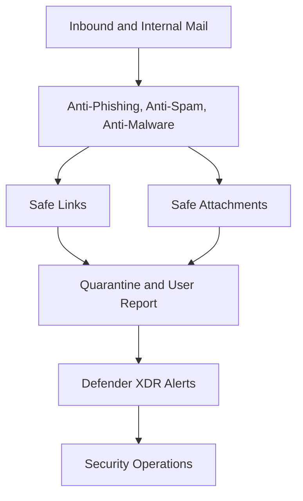

# Defender for Office 365

## Executive Summary

Microsoft Defender for Office 365 protects Exchange Online, Teams, SharePoint and OneDrive collaboration from phishing, malware, malicious links and suspicious attachments.

Enterprise design should combine prevention policies, user coaching, incident response and executive visibility. The goal is not only to block threats, but to reduce business disruption caused by email and collaboration attacks.

## 한국어 요약

Defender for Office 365는 phishing, malware, malicious link, unsafe attachment로부터 Exchange Online과 Microsoft 365 collaboration 환경을 보호합니다.

정책만 켜는 방식이 아니라 Safe Links, Safe Attachments, anti-phishing, quarantine, alert triage, user report, awareness training까지 하나의 email security operating model로 설계해야 합니다.

## Business Scenario

- Phishing protection modernization
- Exchange Online security baseline
- Executive impersonation risk reduction
- Mailbox migration security readiness
- User-reported phishing process
- Copilot data protection readiness

## Protection Architecture

## Core Controls

| Control | Purpose | Design Focus |
|---|---|---|
| Anti-phishing | Protect against spoofing and impersonation | Executive and domain protection |
| Safe Links | Rewrite and inspect suspicious links | User groups, exceptions and reporting |
| Safe Attachments | Detonate attachments before delivery | Delay tolerance and high-risk users |
| Quarantine | Hold suspicious messages | User access and admin review model |
| User submissions | Let users report suspicious mail | Triage workflow and feedback |
| Attack simulation | Improve user resilience | Training campaign and metrics |

## Decision Checklist

| Decision | Recommended Question |
|---|---|
| Protection scope | Which users require the strongest policy first? |
| Executive protection | Which VIPs, domains and display names require impersonation protection? |
| Quarantine access | Can users release messages, or must admins approve? |
| False positives | Who reviews business-critical blocked mail? |
| Incident process | How are user submissions triaged and escalated? |
| Metrics | Which phishing, submission and simulation KPIs are reported? |

## Anti-Patterns

- Applying one policy to every user without pilot validation
- Allowing users to release all quarantined messages without review
- Ignoring executive impersonation and lookalike domain risk
- Treating user-reported phishing as an unmanaged mailbox
- Reporting only blocked message count without incident context

## Delivery Artifacts

- Defender for Office 365 policy matrix
- Quarantine and user submission operating model
- Executive impersonation protection list
- Safe Links and Safe Attachments rollout plan
- Phishing simulation and awareness plan
- Incident triage runbook

## Customer Success Pattern

| Industry | Scenario | Pattern |
|---|---|---|
| Finance | Executive phishing risk | VIP protection, quarantine governance and SOC triage |
| Manufacturing | Exchange Online migration | Security baseline before mailbox cutover |
| Retail | High-volume email operations | False-positive review and user submission workflow |

## 검색 키워드

- Defender for Office 365
- Microsoft 365 email security
- Safe Links Safe Attachments
- anti-phishing policy
- Exchange Online Protection
- Microsoft 365 피싱 방어
- 이메일 보안 아키텍처

## Related Documents

- [Defender XDR](./defender-xdr)
- [Microsoft Defender](./defender)
- [Exchange Online](../microsoft365/exchange-online)
- [Security Reference Architecture](../architecture/security-reference-architecture)

## Contact / Asset Request

For email security baseline checklists, anti-phishing policy reviews, quarantine governance guides or incident triage runbooks, use [Contact and Asset Request](../contact).
