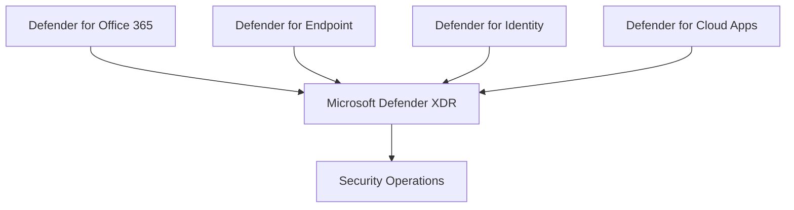

# Microsoft Defender

## Executive Summary

Microsoft Defender is the security platform that brings together endpoint, identity, email, collaboration, cloud app and XDR capabilities.

For enterprise architecture, the goal is not to enable every feature at once. The goal is to build a practical detection, response and prevention model that aligns with identity, device, data and operational ownership.

## Business Scenario

- Consolidate fragmented security tooling
- Improve incident response across email, endpoint and identity
- Reduce phishing, malware and lateral movement risk
- Establish executive security reporting
- Prepare security posture for Copilot and AI adoption

## Architecture

## Implementation

1. Confirm licensing and security portal access.
2. Enable core workloads in pilot scope.
3. Validate alert flow, incident correlation and RBAC.
4. Tune policies by risk and user group.
5. Establish SOC triage and escalation workflow.
6. Document operational runbooks and exception handling.

## Licensing

Microsoft 365 E5 commonly provides the broadest Defender XDR capability. E3 environments may require add-ons depending on endpoint, identity, cloud app and email protection requirements.

## Security

- Separate security reader, analyst, responder and admin roles.
- Integrate Defender signals with Conditional Access where appropriate.
- Review alert noise before executive reporting.
- Validate phishing and endpoint scenarios with controlled tests.

## Decision Checklist

| Decision | Recommended Question |
|---|---|
| Workload scope | Which Defender workloads are included in the first rollout? |
| SOC ownership | Who triages incidents and who approves response actions? |
| Alert tuning | Which alerts are high priority and which require suppression or tuning? |
| RBAC | Which users need reader, analyst, responder or administrator roles? |
| Integration | Should Defender signals connect to Sentinel, ITSM or Conditional Access? |
| Reporting | Which metrics are reported to CISO or executive stakeholders? |

## Anti-Patterns

- Enabling Defender workloads without SOC ownership
- Reporting every alert without severity and business impact context
- Giving broad security admin rights instead of role-based access
- Ignoring alert tuning after initial deployment
- Treating Defender as a single tool instead of an operating model

## Delivery Artifacts

- Defender XDR target operating model
- Defender workload onboarding plan
- Security role and RBAC matrix
- Alert triage and escalation runbook
- Incident response workflow
- Executive security dashboard

## Customer Success Pattern

| Industry | Scenario | Pattern |
|---|---|---|
| Financial Services | XDR modernization | SOC ownership, incident triage and executive risk reporting |
| Manufacturing | Endpoint and email security | Phased Defender rollout with alert tuning and pilot groups |
| SaaS | Customer security assurance | Defender evidence and incident response process for due diligence |

## Lessons Learned

Defender projects work best when framed as an operating model. Tool enablement is only the beginning; triage ownership, alert tuning and response playbooks determine real security value.

## 검색 키워드

- Microsoft Defender
- Microsoft Defender XDR
- Defender for Endpoint
- Defender for Office 365
- security operations model
- Defender XDR 운영 모델
- Microsoft 보안 운영

## Related Documents

- [Defender XDR](./defender-xdr)
- [Defender for Endpoint](./defender-for-endpoint)
- [Defender for Office 365](./defender-for-office365)
- [Security Reference Architecture](../architecture/security-reference-architecture)
