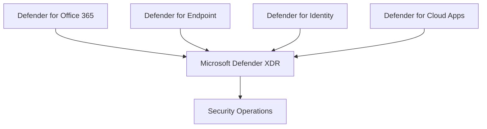

# Microsoft Defender

## Executive Summary

Microsoft Defender is the security platform that brings together endpoint, identity, email, collaboration, cloud app and XDR capabilities.

For enterprise architecture, the goal is not to enable every feature at once. The goal is to build a practical detection, response and prevention model that aligns with identity, device, data and operational ownership.

## Business Scenario

- Consolidate fragmented security tooling
- Improve incident response across email, endpoint and identity
- Reduce phishing, malware and lateral movement risk
- Establish executive security reporting
- Prepare security posture for Copilot and AI adoption

## Architecture

## Implementation

1. Confirm licensing and security portal access.
2. Enable core workloads in pilot scope.
3. Validate alert flow, incident correlation and RBAC.
4. Tune policies by risk and user group.
5. Establish SOC triage and escalation workflow.
6. Document operational runbooks and exception handling.

## Licensing

Microsoft 365 E5 commonly provides the broadest Defender XDR capability. E3 environments may require add-ons depending on endpoint, identity, cloud app and email protection requirements.

## Security

- Separate security reader, analyst, responder and admin roles.
- Integrate Defender signals with Conditional Access where appropriate.
- Review alert noise before executive reporting.
- Validate phishing and endpoint scenarios with controlled tests.

## Lessons Learned

Defender projects work best when framed as an operating model. Tool enablement is only the beginning; triage ownership, alert tuning and response playbooks determine real security value.
