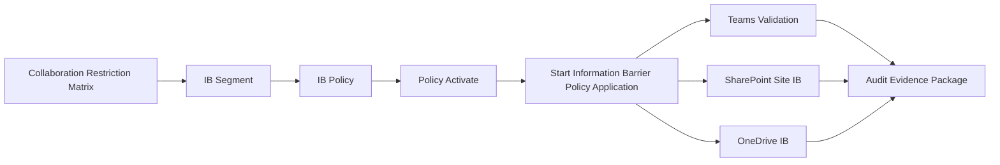
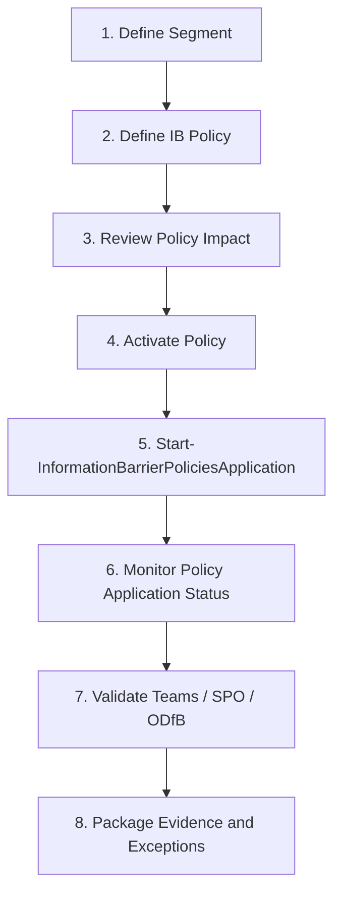

# Microsoft Purview Information Barriers

Microsoft Purview Information Barriers(IB)는 조직 내 이해상충, 업무분장, 내부통제 요구사항에 따라 사용자 또는 부서 간 커뮤니케이션과 공동 작업을 제한하는 기능입니다.

IB는 단순히 특정 사용자를 차단하는 설정이 아닙니다. 먼저 조직의 협업 제한 Matrix를 정의하고, 이를 기반으로 Segment, Policy, Workload 적용, 검증, 증적 관리까지 하나의 통제 체계로 설계해야 합니다.

## 적용 시나리오

| Scenario | Typical Requirement | Design Focus |
|---|---|---|
| 이해상충 분리 | 특정 부서 간 커뮤니케이션 제한 | Segment Matrix, 대칭 Policy, 예외 사용자 관리 |
| M&A / 계열 분리 | 조직 단위별 협업 경계 분리 | Multi-segment 설계, Teams/SPO/ODfB 검증 |
| 금융/투자 업무분장 | 정보 장벽 및 Chinese Wall 통제 | 감사 증적, 승인 절차, 정책 변경 이력 |
| 민감 프로젝트 | 프로젝트별 접근 및 공유 제한 | SharePoint site Segment, Owner Moderated 검토 |
| Copilot 데이터 보호 | Copilot 확산 전 협업 경계 정비 | Graph permission, Purview, DLP, IB 연계 |

## 구현 아키텍처

## 설계 원칙

| Principle | Guidance |
|---|---|
| Matrix First | 정책 생성 전에 부서/사용자 간 허용·차단 Matrix를 먼저 확정합니다. |
| Symmetric Policy | A에서 B를 차단했다면 B에서 A를 차단하는 대칭 Policy도 필요합니다. |
| Exception by Segment | 특정 사용자 예외가 필요하면 개별 예외 사용자를 별도 Segment로 분리합니다. |
| Workload Validation | Teams, SharePoint, OneDrive는 정책 적용 방식과 검증 항목이 다릅니다. |
| Evidence Ready | 정책 설정, 테스트 결과, 오류 화면, 로그를 감사 대응 패키지로 보관합니다. |
| Rollback Planned | Segment/Policy 삭제보다 비활성화, 영향 검증, Application 재실행 순서를 먼저 정의합니다. |

## Prerequisites

- Microsoft Purview Information Barriers를 지원하는 라이선스
- Purview Information Barriers 관리 권한
- ExchangeOnlineManagement module
- IPPSSession 연결 가능 관리자 계정
- SharePoint Online Management Shell
- 테스트 사용자 2명 이상
- 테스트 사용자별 department 또는 정책 기준 속성
- Teams, SharePoint, OneDrive 검증 환경

라이선스와 세부 기능 범위는 테넌트 계약, service plan, Microsoft 365 로드맵에 따라 달라질 수 있습니다. 제안서나 구현 산출물에는 반드시 실제 테넌트의 service plan 상태를 함께 확인해야 합니다.

## Segment Design

IB Segment는 정책의 기본 단위입니다. 일반적으로 department, company, office, role, custom attribute 같은 사용자 속성을 기준으로 Segment를 구성합니다.

### Segment Matrix Example

| Department | Allow | Block |
|---|---|---|
| Segment 1 | Segment 1 | Segment 2 |
| Segment 2 | Segment 2 | Segment 1 |
| Exception User Group | Approved counterpart only | All other restricted Segments |

이 Matrix는 기술 설정표가 아니라 비즈니스 승인 문서입니다. Security, Compliance, HR, Legal, Business Owner가 함께 검토해야 하며, 운영 중 변경 요청이 발생하면 변경 사유와 승인자를 남겨야 합니다.

## Policy Design

IB Policy는 Segment 간 커뮤니케이션과 공동 작업을 허용하거나 차단합니다.

### Block-list Pattern

Block-list Pattern은 특정 Segment 간 협업을 명시적으로 차단하는 방식입니다.

- 부서 간 이해상충 차단에 적합합니다.
- 차단 대상이 명확할 때 관리가 쉽습니다.
- Segment 간 대칭 Policy가 누락되면 한쪽 방향만 차단될 수 있습니다.

### Allow-list Pattern

Allow-list Pattern은 허용된 Segment 간 협업만 가능하게 설계하는 방식입니다.

- 엄격한 통제 환경에 적합합니다.
- 예외 처리가 많으면 운영 복잡도가 올라갑니다.
- 신규 조직 또는 신규 사용자가 추가될 때 기본 차단 상태가 될 수 있으므로 운영 절차가 필요합니다.

## Policy Activation Flow

정책은 생성 즉시 운영에 반영하는 방식으로 접근하지 않는 것이 좋습니다. 먼저 정책 내용을 검토하고, 승인 후 활성화한 다음, Microsoft 365 workload에서 정책을 사용할 수 있도록 application start 단계를 수행해야 합니다.

## SharePoint and OneDrive 적용

SharePoint Online과 OneDrive for Business(ODfB)는 Purview에서 정의한 Segment/Policy만으로 끝나지 않습니다. Workload 수준의 활성화와 site-level Segment 연결, mode 검토가 필요합니다.

IB가 SharePoint 또는 OneDrive에 적용되면 다음 활동이 Segment 정책에 따라 제어됩니다.

- 사이트에 사용자 추가
- 사이트 또는 문서 라이브러리 접근
- 사이트 또는 파일 공유
- People Picker 및 검색 노출
- 기존 공유 링크와 기존 권한의 실제 접근 가능 여부

### SharePoint / OneDrive Mode

| Mode | Usage |
|---|---|
| Open | 사이트에 Segment가 없고 일반 협업을 허용하는 기본 상태 |
| Owner Moderated | 사이트 소유자가 Segment 정책 범위 안에서 멤버십을 관리 |
| Implicit | Teams에 연결된 사이트 또는 그룹 기반 시나리오에서 사용 |
| Explicit | 사이트에 명시적으로 Segment를 연결하고 일치하는 사용자만 접근 허용 |

### Implementation Notes

- SharePoint tenant에서 IB suspension 상태를 확인하고 필요한 경우 활성화합니다.
- Teams 연결 사이트는 Implicit mode 제약을 고려해야 합니다.
- Explicit mode는 Segment가 연결된 사이트에서 강력한 접근 제어를 제공합니다.
- OneDrive는 사용자 Segment에 따라 자동 적용되는 성격이 강하므로 개별 OneDrive마다 site Segment를 수동 연결하는 방식으로 설계하지 않습니다.
- 정책 반영에는 지연이 발생할 수 있으므로 즉시 실패로 판단하지 말고 application status와 propagation window를 함께 확인합니다.

## Teams 검증

Teams는 IB 정책 적용 후 가장 먼저 사용자가 체감하는 workload 중 하나입니다.

| Test Case | Expected Result |
|---|---|
| 차단 대상 사용자 간 1:1 chat | 대화 시작 또는 메시지 전송 차단 |
| 차단 대상 사용자 포함 group chat | 초대 또는 대화 참여 차단 |
| Team member 추가 | 정책에 맞지 않는 사용자는 추가 차단 |
| 동일 Segment 사용자 chat | 정상 허용 |
| 예외 Segment 사용자 | 승인된 방향과 상대에 대해서만 허용 |

검증 시에는 허용 시나리오와 차단 시나리오를 모두 캡처해야 합니다. 차단 화면만 남기면 운영팀이 정상 협업 영향도를 판단하기 어렵습니다.

## SharePoint / OneDrive 검증

| Test Case | Expected Result |
|---|---|
| 사이트 멤버 추가 | Segment 불일치 사용자는 추가 차단 |
| 사이트 접근 | Segment 불일치 사용자는 접근 차단 |
| 문서 라이브러리 접근 | 기존 권한이 있어도 IB 정책에 따라 차단 |
| 파일 직접 링크 접근 | 링크를 보유해도 Segment 불일치 시 접근 차단 |
| 파일/폴더 공유 | 공유 대상 검증 후 차단 또는 허용 |
| People Picker / Search | 상대 Segment 사용자가 검색 결과에서 제한 |
| 동일 Segment 사용자 접근 | 정상 허용 |
| 사이트 소유자 권한 | 소유자 권한으로 IB를 우회할 수 없는지 확인 |

## Exchange 고려사항

IB를 설계할 때 Exchange Online까지 동일한 방식으로 제어된다고 가정하면 안 됩니다. 메일 흐름 기반의 송수신 제한은 Exchange mail flow rule 또는 transport rule 기반 설계를 별도로 검토해야 합니다.

실무적으로는 다음 두 가지를 분리해서 설명하는 것이 안전합니다.

- Collaboration boundary: Teams, SharePoint, OneDrive 중심의 IB 통제
- Messaging boundary: Exchange mail flow rule, transport rule, moderation, DLP 중심의 메일 통제

## Evidence Package

정보보호팀 또는 감사 대응을 위해 다음 증적을 하나의 패키지로 보관합니다.

| Evidence | Purpose |
|---|---|
| Segment Matrix | 비즈니스 승인 기준 |
| Policy List | Segment별 차단/허용 정책 확인 |
| Policy Application Status | 정책 적용 완료 여부 확인 |
| Teams Validation Screenshot | chat, group chat, member add 테스트 |
| SharePoint Validation Screenshot | site access, member add, file sharing 테스트 |
| OneDrive Validation Screenshot | direct link, folder sharing, same Segment access 테스트 |
| Exception Register | 예외 사용자, 승인자, 만료일 관리 |
| Rollback Plan | 장애 발생 시 영향 최소화 |

증적 이미지에는 실 UPN, 이메일 주소, 테넌트 도메인, 사용자 이름 등 개인식별정보가 노출되지 않도록 마스킹해야 합니다.

## Troubleshooting

| Symptom | Likely Cause | Response |
|---|---|---|
| 정책을 만들었지만 Teams에서 차단되지 않음 | Policy가 Active가 아니거나 application start 미완료 | Policy state와 application status 확인 |
| SharePoint 사이트에서 여전히 접근 가능 | Site mode 또는 Segment 연결 누락 | site mode, assigned Segment, 기존 권한 재검토 |
| OneDrive 반영이 늦음 | Segment 변경 후 propagation 지연 | 최대 24시간 지연 가능성을 고려하고 재검증 |
| People Picker에는 보이지만 공유가 실패 | 검색 단계와 실제 공유 검증 단계 차이 | 실제 공유/접근 결과 기준으로 판단 |
| 예외 사용자가 차단됨 | 예외 Segment 또는 대칭 허용 Policy 누락 | 예외 Segment와 양방향 Policy 확인 |
| 기존 공유 링크가 우회처럼 보임 | 기존 권한과 링크 캐시 영향 | 직접 접근, 새 세션, 정책 상태를 함께 확인 |

## Rollback Pattern

운영 장애가 발생했을 때 바로 Segment를 삭제하면 추적성이 떨어질 수 있습니다. 다음 순서로 접근하는 것이 안전합니다.

1. 영향 사용자와 workload를 확인합니다.
2. 정책을 비활성화할지, 예외 Segment를 추가할지 결정합니다.
3. 변경 승인자를 기록합니다.
4. Policy 변경 후 Start-InformationBarrierPoliciesApplication을 다시 실행합니다.
5. Teams, SharePoint, OneDrive 검증을 반복합니다.
6. 최종 변경 사항과 잔여 리스크를 evidence package에 반영합니다.

## Consulting Deliverables

- Information Barrier design workshop material
- Segment and collaboration restriction Matrix
- IB Policy design sheet
- SharePoint / OneDrive IB mode decision table
- Teams validation checklist
- SharePoint / OneDrive validation checklist
- Evidence package template
- Rollback and exception management procedure

## Search Keywords

- Microsoft Purview Information Barriers
- Information Barrier implementation
- Microsoft 365 Chinese Wall
- Teams Information Barriers
- SharePoint Information Barriers
- OneDrive Information Barriers
- Purview Segment Policy
- Microsoft 365 collaboration restriction
- Microsoft 365 정보 장벽
- Microsoft 365 협업 제한
- SharePoint OneDrive Information Barrier
- Teams Segment Communication validation

## Related Pages

- [Microsoft Purview Information Protection](./purview-information-protection)
- [Purview](./purview)
- [DLP](./dlp)
- [Microsoft Teams Governance](../microsoft365/teams)
- [SharePoint Information Architecture](../microsoft365/sharepoint)
- [OneDrive](../microsoft365/onedrive)

## Microsoft References

- [Microsoft Learn: Information barriers](https://learn.microsoft.com/en-us/purview/information-barriers)
- [Microsoft Learn: Use information barriers with SharePoint](https://learn.microsoft.com/en-us/purview/information-barriers-sharepoint)
- [Microsoft Learn: Use information barriers with OneDrive](https://learn.microsoft.com/en-us/purview/information-barriers-onedrive)
