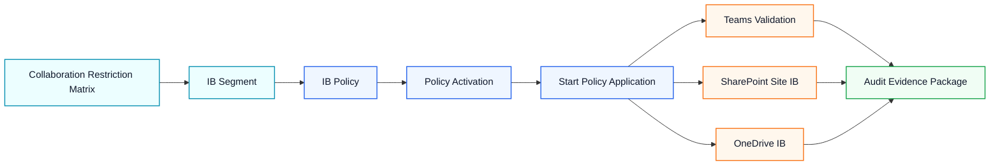
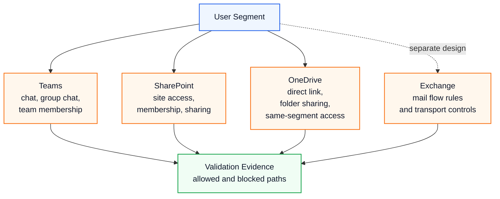

# Microsoft Purview Information Barriers

Microsoft Purview Information Barriers (IB) is used to restrict communication and collaboration between users or groups when the organization has conflict-of-interest, segregation-of-duty, internal control or regulated collaboration requirements.

IB should not be treated as a simple user blocking feature. It should be designed as a control model that connects collaboration restriction matrix, segments, policies, workload validation, exception management and audit evidence.

> **Executive lens:** Information Barriers are not just a Teams chat restriction. They are a segmentation model across users, groups, sites and collaboration workloads that must be validated with both allowed and blocked communication evidence.

## 적용 시나리오

| Scenario | Typical Requirement | Design Focus |
|---|---|---|
| 이해상충 분리 | 특정 부서 간 커뮤니케이션 제한 | Segment Matrix, symmetric policy, exception users |
| M&A / 계열 분리 | 조직 단위별 협업 경계 분리 | multi-segment design, Teams/SPO/ODfB validation |
| 금융 / 투자 업무분장 | Chinese Wall 및 정보 장벽 통제 | audit evidence, approval flow, policy change history |
| 민감 프로젝트 | 프로젝트별 접근 및 공유 제한 | SharePoint site segment, owner moderated review |
| Copilot 데이터 보호 | Copilot 확산 전 협업 경계 정비 | Graph permission, Purview, DLP, IB alignment |

## 구현 아키텍처

## 설계 원칙

| Principle | Guidance |
|---|---|
| Matrix First | 정책을 만들기 전에 부서/사용자 간 허용 및 차단 Matrix를 먼저 확정합니다. |
| Symmetric Policy | A에서 B를 차단했다면 B에서 A를 차단하는 대칭 정책도 검토합니다. |
| Exception by Segment | 예외 사용자가 필요하면 개별 예외 사용자를 별도 Segment로 분리합니다. |
| Workload Validation | Teams, SharePoint, OneDrive는 정책 적용 방식과 검증 항목이 다릅니다. |
| Evidence Ready | 정책 설정, 테스트 결과, 오류 화면, 로그를 감사 대응 패키지로 보관합니다. |
| Rollback Planned | Segment/Policy 삭제보다 비활성화, 영향 검증, application 재실행 순서를 먼저 정의합니다. |

## Prerequisites

- Microsoft Purview Information Barriers를 지원하는 라이선스
- Purview Information Barriers 관리 권한
- ExchangeOnlineManagement module
- IPPSSession 연결 가능 관리자 계정
- SharePoint Online Management Shell
- 테스트 사용자 2명 이상
- 테스트 사용자별 department 또는 정책 기준 속성
- Teams, SharePoint, OneDrive 검증 환경

## Segment Design

Segment는 단순 부서명이 아니라 정책 경계를 표현하는 단위입니다.

| Segment Type | Example | Notes |
|---|---|---|
| Department Segment | Finance, Investment, Advisory | 가장 일반적인 업무분장 기준 |
| Project Segment | Project A, Project B | 민감 프로젝트 또는 제한된 협업 공간 |
| Subsidiary Segment | Company A, Company B | 계열사 또는 인수합병 시나리오 |
| Exception Segment | Approved exception users | 예외 승인 및 만료일 관리 필요 |
| Regulated Segment | Compliance restricted group | 감사 증적과 승인 이력 필수 |

## Workload Control Pattern

## Teams 검증

Teams는 IB 정책 적용 후 사용자가 가장 먼저 체감하는 workload 중 하나입니다.

| Test Case | Expected Result |
|---|---|
| 차단 대상 사용자 간 1:1 chat | 대화 시작 또는 메시지 전송 차단 |
| 차단 대상 사용자가 포함된 group chat | 초대 또는 대화 참여 차단 |
| Team member 추가 | 정책에 맞지 않는 사용자는 추가 차단 |
| 동일 Segment 사용자 chat | 정상 허용 |
| 예외 Segment 사용자 | 승인된 방향과 상대에 대해서만 허용 |

검증 시에는 허용 시나리오와 차단 시나리오를 모두 캡처해야 합니다. 차단 화면만 남기면 운영팀이 정상 협업 영향도를 판단하기 어렵습니다.

## SharePoint / OneDrive 검증

| Test Case | Expected Result |
|---|---|
| 사이트 멤버 추가 | Segment 불일치 사용자는 추가 차단 |
| 사이트 접근 | Segment 불일치 사용자는 접근 차단 |
| 문서 라이브러리 접근 | 기존 권한이 있어도 IB 정책에 따라 차단 |
| 파일 직접 링크 접근 | 링크를 보유해도 Segment 불일치 시 접근 차단 |
| 파일/폴더 공유 | 공유 대상 검증 후 차단 또는 허용 |
| People Picker / Search | 상대 Segment 사용자가 검색 결과에서 제한 |
| 동일 Segment 사용자 접근 | 정상 허용 |
| 사이트 소유자 권한 | 소유자 권한으로 IB를 우회할 수 없는지 확인 |

## Exchange 고려사항

IB를 설계할 때 Exchange Online까지 동일한 방식으로 제어된다고 가정하면 안 됩니다. 메일 흐름 기반의 송수신 제한은 Exchange mail flow rule 또는 transport rule 기반 설계를 별도로 검토해야 합니다.

- Collaboration boundary: Teams, SharePoint, OneDrive 중심의 IB 통제
- Messaging boundary: Exchange mail flow rule, transport rule, moderation, DLP 중심의 메일 통제

## Evidence Package

정보보호팀 또는 감사 대응을 위해 다음 증적을 하나의 패키지로 보관합니다.

| Evidence | Purpose |
|---|---|
| Segment Matrix | 비즈니스 승인 기준 |
| Policy List | Segment별 차단/허용 정책 확인 |
| Policy Application Status | 정책 적용 완료 여부 확인 |
| Teams Validation Screenshot | chat, group chat, member add 테스트 |
| SharePoint Validation Screenshot | site access, member add, file sharing 테스트 |
| OneDrive Validation Screenshot | direct link, folder sharing, same Segment access 테스트 |
| Exception Register | 예외 사용자, 승인자, 만료일 관리 |
| Rollback Plan | 장애 발생 시 영향 최소화 |

증적 이미지에는 실제 UPN, 이메일 주소, tenant domain, 사용자 이름 등 개인정보가 노출되지 않도록 마스킹해야 합니다.

## Troubleshooting

| Symptom | Likely Cause | Response |
|---|---|---|
| Teams에서 차단되지 않음 | Policy가 Active가 아니거나 application start 미완료 | policy state와 application status 확인 |
| SharePoint 사이트 접근 가능 | site mode 또는 Segment 연결 누락 | site mode, assigned Segment, 기존 권한 재검토 |
| OneDrive 반영 지연 | Segment 변경 후 propagation 지연 | 최대 24시간 지연 가능성을 고려하고 재검증 |
| People Picker에는 보이지만 공유 실패 | 검색 단계와 실제 공유 검증 단계 차이 | 실제 공유/접근 결과 기준으로 판단 |
| 예외 사용자가 차단됨 | 예외 Segment 또는 대칭 허용 Policy 누락 | 예외 Segment와 양방향 Policy 확인 |
| 기존 공유 링크가 우회처럼 보임 | 기존 권한과 링크 캐시 영향 | 직접 접근, 새 세션, 정책 상태를 함께 확인 |

## Rollback Pattern

운영 장애가 발생했을 때 바로 Segment를 삭제하면 추적성이 떨어질 수 있습니다. 다음 순서로 접근하는 것이 안전합니다.

1. 영향 사용자와 workload를 확인합니다.
2. 정책을 비활성화할지, 예외 Segment를 추가할지 결정합니다.
3. 변경 승인자를 기록합니다.
4. Policy 변경 후 `Start-InformationBarrierPoliciesApplication`을 다시 실행합니다.
5. Teams, SharePoint, OneDrive 검증을 반복합니다.
6. 최종 변경 사항과 잔여 리스크를 evidence package에 반영합니다.

## Consulting Deliverables

- Information Barrier design workshop material
- Segment and collaboration restriction Matrix
- IB Policy design sheet
- SharePoint / OneDrive IB mode decision table
- Teams validation checklist
- SharePoint / OneDrive validation checklist
- Evidence package template
- Rollback and exception management procedure

## Search Keywords

- Microsoft Purview Information Barriers
- Information Barrier implementation
- Microsoft 365 Chinese Wall
- Teams Information Barriers
- SharePoint Information Barriers
- OneDrive Information Barriers
- Purview Segment Policy
- Microsoft 365 collaboration restriction
- Microsoft 365 정보 장벽
- Microsoft 365 협업 제한
- SharePoint OneDrive Information Barrier
- Teams Segment Communication validation

## Related Pages

- [Microsoft Purview Information Protection](./purview-information-protection)
- [Purview](./purview)
- [DLP](./dlp)
- [Microsoft Teams Governance](../microsoft365/teams)
- [SharePoint Information Architecture](../microsoft365/sharepoint)
- [OneDrive](../microsoft365/onedrive)

## Microsoft References

- [Microsoft Learn: Information barriers](https://learn.microsoft.com/en-us/purview/information-barriers)
- [Microsoft Learn: Use information barriers with SharePoint](https://learn.microsoft.com/en-us/purview/information-barriers-sharepoint)
- [Microsoft Learn: Use information barriers with OneDrive](https://learn.microsoft.com/en-us/purview/information-barriers-onedrive)
