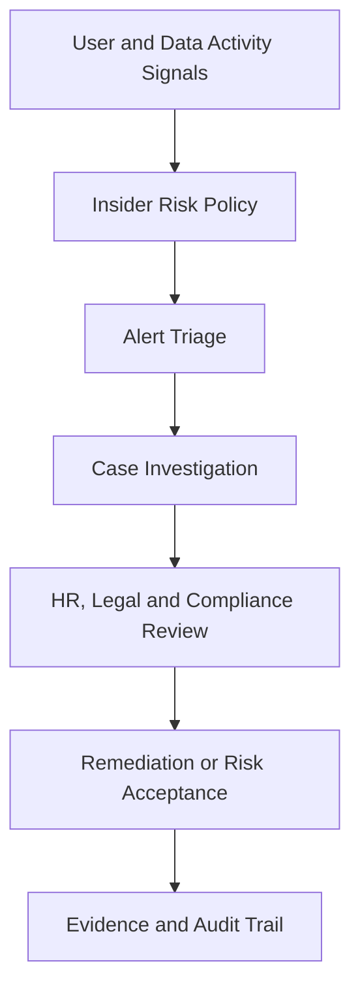

# Insider Risk Management

## Executive Summary

Microsoft Purview Insider Risk Management helps organizations identify risky user activities that may indicate data theft, policy violation, security negligence or business-sensitive behavior.

Because insider risk can involve employee privacy, HR, legal and compliance concerns, the architecture must define governance, case handling, permissions and evidence rules before policies are activated.

## 한국어 요약

Insider Risk Management는 내부자의 의도적 또는 비의도적 위험 행위를 탐지하고 조사하기 위한 Microsoft Purview 기능입니다.

실무에서는 기술 설정보다 privacy, HR/legal involvement, case review process, evidence handling, role separation이 중요합니다. 따라서 정책 활성화 전에 governance model을 먼저 설계해야 합니다.

## Business Scenario

- Sensitive data exfiltration monitoring
- Departing employee risk management
- Security policy violation review
- Data leakage investigation
- Compliance-driven user activity monitoring
- Executive and privileged user risk review

## Insider Risk Architecture

## Core Design Areas

| Area | Design Focus | Output |
|---|---|---|
| Policy scope | User groups, risk scenarios and trigger events | Policy scope matrix |
| Privacy | Pseudonymization, reviewer roles and approval process | Privacy guardrail |
| Investigation | Alert triage, case creation and evidence review | Case handling runbook |
| Governance | HR, legal, compliance and security involvement | Governance model |
| Remediation | User coaching, access review or escalation | Response playbook |

## Decision Checklist

| Decision | Recommended Question |
|---|---|
| Use case | Which insider risk scenario is justified by business risk? |
| Scope | Which users or groups are included, and why? |
| Privacy | How are employee privacy and reviewer access protected? |
| Case ownership | Who can investigate, approve and close cases? |
| Evidence | What evidence can be exported or shared? |
| Remediation | Which actions are allowed after a confirmed risk? |

## Anti-Patterns

- Enabling broad monitoring without privacy and legal review
- Treating insider risk alerts as security incidents without context
- Giving too many administrators access to sensitive case data
- Starting with high-noise policies before piloting specific scenarios
- Failing to document why a user group is in scope

## Delivery Artifacts

- Insider risk governance model
- Policy scope and justification matrix
- Privacy and role separation guide
- Case triage and escalation runbook
- Evidence handling procedure
- Executive risk reporting template

## Customer Success Pattern

| Industry | Scenario | Pattern |
|---|---|---|
| Financial Services | Departing employee risk | Narrow scope, legal review and evidence-based case handling |
| Manufacturing | Sensitive design data | Data exfiltration signal review with Purview labels |
| Technology | Privileged user monitoring | Role-separated investigation and periodic governance review |

## 검색 키워드

- Microsoft Purview Insider Risk Management
- insider risk policy design
- data exfiltration monitoring
- departing employee risk
- insider risk governance
- 내부자 위험 관리
- Microsoft Purview 내부자 위험

## Related Documents

- [Purview](./purview)
- [Data Lifecycle Management](./data-lifecycle)
- [Compliance Manager](./compliance-manager)
- [Security Reference Architecture](../architecture/security-reference-architecture)
