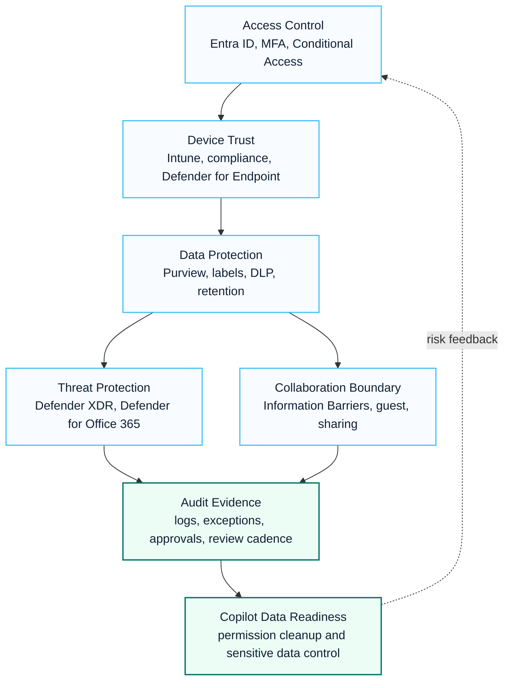

# Security

This Security section organizes Microsoft security architecture, Zero Trust controls and compliance-ready delivery patterns for enterprise Microsoft environments.

The guidance is shaped around field scenarios such as regulated SaaS access, Microsoft 365 security review, Exchange Online protection, endpoint onboarding, Purview readiness, DLP design and Copilot data protection.

  <a class="kc-signal-card" href="./conditional-access">
    <small>ACCESS</small>
    <strong>Identity and Conditional Access</strong>
    Start with Entra ID, MFA, device trust, guest access and policy exception control.
  </a>
  <a class="kc-signal-card" href="./defender-xdr">
    <small>THREAT</small>
    <strong>Defender XDR Operations</strong>
    Connect endpoint, email, identity and incident response into a measurable security operation.
  </a>
  <a class="kc-signal-card" href="./information-barriers">
    <small>DATA</small>
    <strong>Purview Information Barriers</strong>
    Design segment-based collaboration boundaries for Teams, SharePoint and OneDrive.
  </a>

## Visual Security Control Map

## 한국어 요약

Microsoft Security는 Entra ID, Conditional Access, Intune, Defender, Purview, DLP, Audit, Compliance 기능을 하나의 security operating model로 연결할 때 효과가 커집니다.

이 섹션은 Microsoft 365 security assessment, Zero Trust architecture, Conditional Access policy, Defender XDR, Defender for Endpoint, Defender for Office 365, Purview information protection, DLP, Insider Risk, Copilot data protection을 실무 관점에서 정리합니다.

Enterprise security 프로젝트에서는 기술 설정만큼 approval process, exception management, administrator role, audit evidence, user impact가 중요합니다. 특히 금융, SaaS, 제조, 유통, 글로벌 조직처럼 규제와 운영 안정성이 중요한 환경에서는 security policy를 단계적으로 적용해야 합니다.

## Security Domains

| Domain | Microsoft Capabilities | Consulting Focus |
|---|---|---|
| Identity security | Entra ID, MFA, Conditional Access | verify users, devices, locations and risk before access |
| Endpoint security | Intune, Defender for Endpoint | compliance, onboarding, threat protection and device posture |
| Messaging security | Exchange Online, Defender for Office 365 | phishing protection, mail flow, quarantine and safe collaboration |
| Data protection | Purview, sensitivity labels, DLP | classification, sharing control and Copilot data readiness |
| Compliance | audit, retention, insider risk, compliance manager | evidence, policy ownership and operating procedure |
| SaaS access | Global Secure Access, network exception model | controlled access for regulated or separated networks |
| Information barriers | Purview Information Barriers, Teams, SharePoint, OneDrive | segment-based collaboration restriction and evidence-ready validation |

## Typical Field Scenarios

- Microsoft 365 security baseline for new or expanded adoption
- financial services SaaS access readiness in a controlled network
- Exchange Online security review before or after migration
- Defender and Intune onboarding for endpoint compliance
- Purview and DLP readiness before Copilot rollout
- Information Barrier design for regulated collaboration boundaries
- security committee evidence pack for approval gates

## Recommended Reading

- [Zero Trust Framework](./zero-trust-framework)
- [Conditional Access](./conditional-access)
- [Defender XDR](./defender-xdr)
- [Defender for Office 365](./defender-for-office365)
- [Purview](./purview)
- [Microsoft Purview Information Barriers](./information-barriers)
- [DLP](./dlp)
- [Security Modernization Program](../projects/security-modernization-program)

## Delivery Assets

- security baseline checklist
- Conditional Access policy design
- Defender onboarding plan
- Purview and DLP readiness matrix
- Information Barrier Segment Matrix and validation checklist
- risk register and exception workflow
- executive security review pack

## 검색 키워드

이 문서는 다음과 같은 검색어와 관련됩니다.

- Microsoft 365 security
- Microsoft Security Architecture
- Zero Trust architecture
- Entra ID Conditional Access
- Conditional Access policy
- Microsoft Defender XDR
- Defender for Endpoint deployment
- Defender for Office 365
- Microsoft Purview information protection
- Microsoft Purview Information Barriers
- Teams Information Barriers
- SharePoint OneDrive Information Barriers
- DLP policy design
- Copilot data protection

## 컨설팅 활용 사례

이 가이드는 다음과 같은 컨설팅 상황에서 활용할 수 있습니다.

- Microsoft 365 security assessment
- CISO 보고용 security baseline 작성
- Conditional Access policy 설계 및 exception management
- Defender/Purview 기반 security modernization
- Copilot 도입 전 data security review
- 금융/제조/SaaS 환경의 audit-ready security design

## Contact / Asset Request

For security baseline workbooks, control matrices, exception registers, executive security reports or operations handover templates, use [Contact and Asset Request](../contact).
