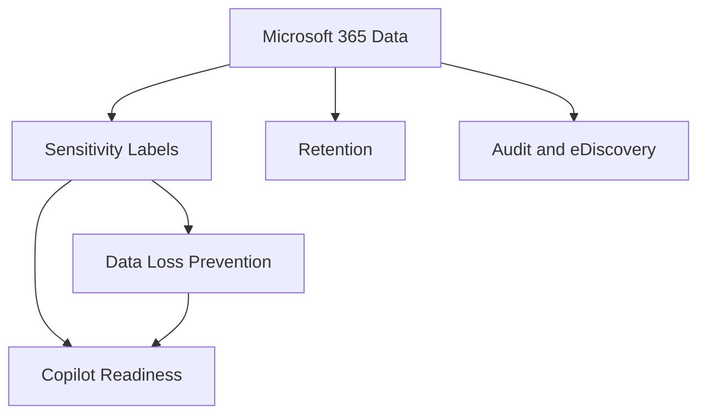

# Purview

## Executive Summary

Microsoft Purview provides the governance, compliance and data protection layer for Microsoft 365 and enterprise data environments.

For Copilot and AI adoption, Purview is especially important because AI experiences inherit existing permissions, labels, retention settings and data exposure patterns. A strong Purview foundation helps organizations control sensitive data before expanding Copilot, search and agent scenarios.

## Business Scenario

Typical business drivers:

- Classify and protect sensitive documents
- Reduce accidental data leakage through DLP
- Prepare Microsoft 365 data for Copilot adoption
- Support audit, retention and eDiscovery requirements
- Govern insider risk and communication compliance
- Establish information protection standards across departments

For an enterprise group governance program, the practical value of Purview was not only policy enforcement. It created a common language between legal, security, IT and business owners for what data should be protected and how exceptions should be approved.

## Architecture

Core components:

- Sensitivity labels for classification and encryption
- DLP policies for Exchange, SharePoint, OneDrive, Teams and endpoints
- Retention labels and policies
- Audit, eDiscovery and communication compliance
- Insider risk management
- Data lifecycle management

## Implementation

Recommended implementation sequence:

1. Identify sensitive data categories and business owners.
2. Define classification taxonomy and label naming.
3. Pilot labels with a small group before broad publishing.
4. Configure DLP in test mode and review false positives.
5. Align retention policy with legal and operational requirements.
6. Validate Copilot readiness by reviewing oversharing and sensitive content exposure.
7. Define exception, escalation and policy review cadence.

## Licensing

Purview capabilities depend on Microsoft 365 licensing. Advanced DLP, Insider Risk Management, eDiscovery Premium and some governance features generally require higher-tier compliance licensing. Licensing should be validated against the exact control requirements before proposal finalization.

## Security

Security design should focus on:

- Who can create, publish and modify labels
- Which data types require encryption
- Which sharing scenarios require block, warning or audit-only behavior
- How DLP alerts are triaged
- How policy exceptions are approved and reviewed
- How Copilot access is monitored against sensitive repositories

## Best Practice

- Do not start with too many labels. A small, usable taxonomy wins.
- Use test mode for DLP before enforcement.
- Include business owners in sensitive data definitions.
- Review SharePoint oversharing before Copilot rollout.
- Keep exception records auditable.

## Troubleshooting

- Label not visible: check label policy publishing and user scope.
- DLP not triggering: confirm workload location, condition logic and test mode status.
- Excessive false positives: tune sensitive information types and thresholds.
- Copilot exposure concern: review permissions, labels, sharing links and site ownership.

## Lessons Learned

Purview adoption is partly technical and partly behavioral. Policies that are too strict from day one are often bypassed. The stronger pattern is to start with visibility, tune policies with evidence, and then enforce controls in waves.

## Frequently Asked Questions

### Where should Purview adoption start?

Start with business data categories, a small sensitivity label taxonomy and priority DLP scenarios. Avoid launching too many labels or block policies before user behavior and false positives are understood.

### How does Purview support Copilot readiness?

Purview helps classify, protect, audit and govern sensitive information that Copilot may reason over through Microsoft 365 permissions. It should be paired with oversharing review and site ownership cleanup.

### Who should own Purview policy decisions?

Security, compliance, legal, IT and business data owners should make policy decisions together. Technical administrators should not define sensitive data categories alone.

### What evidence should be prepared?

Prepare label taxonomy, policy publishing scope, DLP test results, exception process, audit configuration, retention decisions and Copilot data protection notes.

## Evidence Checklist

| Evidence | Purpose |
|---|---|
| Label taxonomy | show business-readable classification structure |
| Label policy scope | prove who receives which labels and why |
| DLP test result | validate policy effect before enforcement |
| Exception register | document approvals, reasons and expiry |
| Oversharing review | identify sensitive repositories before Copilot expansion |
| Review cadence | define how policies are tuned and approved over time |

## References

- Microsoft Purview compliance portal
- Microsoft 365 audit and eDiscovery documentation
- Microsoft Copilot data protection guidance

## MVP 커뮤니티 기반 설계 메모

Public Microsoft 365 compliance 전문가들이 자주 강조하는 점은, Purview가 성공하려면 policy design이 기술적으로 정확할 뿐 아니라 business owner가 이해할 수 있어야 한다는 것입니다.

Enterprise delivery에서는 다음 패턴이 가장 안정적입니다.

- 사용자가 실제로 이해할 수 있는 작은 sensitivity label taxonomy부터 시작합니다.
- DLP는 바로 차단하지 말고 test mode에서 false positive를 확인한 뒤 조정합니다.
- sensitivity label을 일반적인 보안 등급이 아니라 실제 business data category와 연결합니다.
- exception approval, policy ownership, review cadence를 문서화합니다.
- Copilot은 기존 access/protection boundary를 따르므로 Purview rollout과 Copilot readiness를 함께 봅니다.
- Legal, Security, IT, Business stakeholder가 같은 decision table에서 의사결정하도록 합니다.

## 한국어 검색 키워드

이 문서는 다음과 같은 한국어 검색어와도 관련됩니다.

- Microsoft Purview adoption
- Purview DLP policy design
- sensitivity label design
- Microsoft 365 data protection
- Copilot data protection
- Purview compliance consulting

## 커뮤니티 및 공식 참고 자료

- [Joanne C Klein](https://joannecklein.com/)
- [Microsoft Purview documentation](https://learn.microsoft.com/en-us/purview/)
- [MVP and Community Research Map](../knowledge-center/mvp-community-research-map)

## Contact / Asset Request

For security baseline workbooks, control matrices, exception registers, executive security reports or operations handover templates, use [Contact and Asset Request](../contact).
