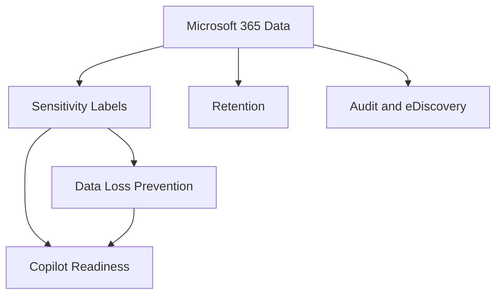

# Purview

## Executive Summary

Microsoft Purview provides the governance, compliance and data protection layer for Microsoft 365 and enterprise data environments.

For Copilot and AI adoption, Purview is especially important because AI experiences inherit existing permissions, labels, retention settings and data exposure patterns. A strong Purview foundation helps organizations control sensitive data before expanding Copilot, search and agent scenarios.

## Business Scenario

Typical business drivers:

- Classify and protect sensitive documents
- Reduce accidental data leakage through DLP
- Prepare Microsoft 365 data for Copilot adoption
- Support audit, retention and eDiscovery requirements
- Govern insider risk and communication compliance
- Establish information protection standards across departments

For an enterprise group governance program, the practical value of Purview was not only policy enforcement. It created a common language between legal, security, IT and business owners for what data should be protected and how exceptions should be approved.

## Architecture

Core components:

- Sensitivity labels for classification and encryption
- DLP policies for Exchange, SharePoint, OneDrive, Teams and endpoints
- Retention labels and policies
- Audit, eDiscovery and communication compliance
- Insider risk management
- Data lifecycle management

## Implementation

Recommended implementation sequence:

1. Identify sensitive data categories and business owners.
2. Define classification taxonomy and label naming.
3. Pilot labels with a small group before broad publishing.
4. Configure DLP in test mode and review false positives.
5. Align retention policy with legal and operational requirements.
6. Validate Copilot readiness by reviewing oversharing and sensitive content exposure.
7. Define exception, escalation and policy review cadence.

## Licensing

Purview capabilities depend on Microsoft 365 licensing. Advanced DLP, Insider Risk Management, eDiscovery Premium and some governance features generally require higher-tier compliance licensing. Licensing should be validated against the exact control requirements before proposal finalization.

## Security

Security design should focus on:

- Who can create, publish and modify labels
- Which data types require encryption
- Which sharing scenarios require block, warning or audit-only behavior
- How DLP alerts are triaged
- How policy exceptions are approved and reviewed
- How Copilot access is monitored against sensitive repositories

## Best Practice

- Do not start with too many labels. A small, usable taxonomy wins.
- Use test mode for DLP before enforcement.
- Include business owners in sensitive data definitions.
- Review SharePoint oversharing before Copilot rollout.
- Keep exception records auditable.

## Troubleshooting

- Label not visible: check label policy publishing and user scope.
- DLP not triggering: confirm workload location, condition logic and test mode status.
- Excessive false positives: tune sensitive information types and thresholds.
- Copilot exposure concern: review permissions, labels, sharing links and site ownership.

## Lessons Learned

Purview adoption is partly technical and partly behavioral. Policies that are too strict from day one are often bypassed. The stronger pattern is to start with visibility, tune policies with evidence, and then enforce controls in waves.

## References

- Microsoft Purview compliance portal
- Microsoft 365 audit and eDiscovery documentation
- Microsoft Copilot data protection guidance
