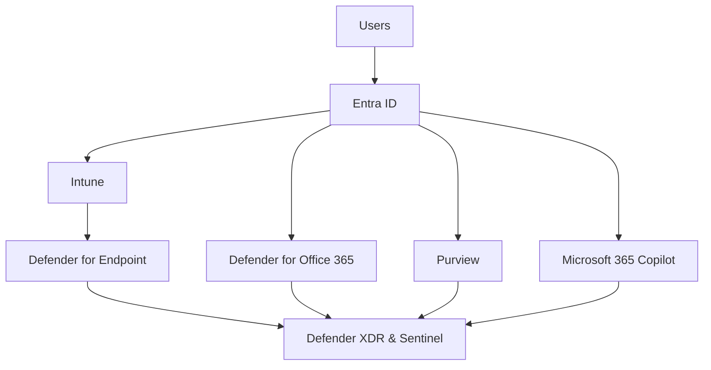
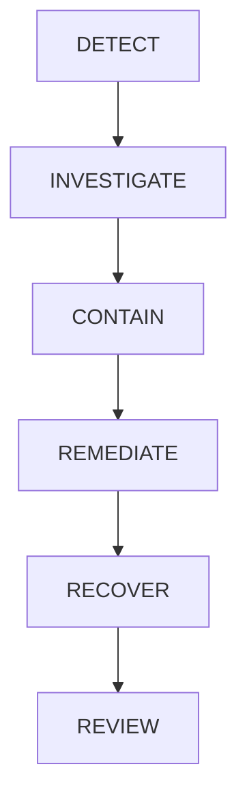

---
id: security-architecture
title: Enterprise Security Architecture
sidebar_label: Security Architecture
---

# Enterprise Security Architecture

## Executive Summary

Modern enterprise security requires an integrated platform approach rather than isolated security products.

Microsoft Security provides a unified architecture across Identity, Endpoint, Application, Data, AI, and Security Operations.

This document presents an enterprise security reference architecture used for Microsoft 365, Azure, Security, Copilot and AI transformation projects.

---

# Security Vision

## Business Objectives

Organizations must achieve:

- Secure Hybrid Work
- Zero Trust Security
- Data Protection
- Regulatory Compliance
- AI Governance
- Operational Resilience

---

# Security Reference Architecture

---

# Security Domains

| Domain | Platform |
|----------|----------|
| Identity | Microsoft Entra ID |
| Endpoint | Intune |
| Threat Protection | Microsoft Defender |
| Data Protection | Microsoft Purview |
| AI Security | Microsoft Copilot |
| Monitoring | Defender XDR |
| SIEM | Microsoft Sentinel |
| Access Control | Conditional Access |
| Network Access | Global Secure Access |

---

# Identity Security

Identity is the primary security perimeter.

---

## Core Services

### Microsoft Entra ID

Provides:

- Authentication
- Authorization
- SSO
- Identity Governance

---

## Key Controls

### MFA

Required

### Passwordless Authentication

Recommended

### Conditional Access

Required

### Risk-Based Policies

Required

---

# Device Security

## Microsoft Intune

Provides:

- Device Enrollment
- Configuration Management
- Compliance Validation
- Application Management

---

## Managed Device Requirements

Windows

- BitLocker
- Defender Active
- Current Patch Level

macOS

- Defender Active
- Encryption Enabled

Mobile

- Passcode
- Encryption
- Compliance Policy

---

# Endpoint Protection

## Microsoft Defender for Endpoint

Provides:

- EDR
- Vulnerability Management
- Threat Hunting
- Device Risk Assessment

---

## Security Objectives

Detect:

- Malware
- Ransomware
- Lateral Movement
- Credential Theft

Respond:

- Isolation
- Investigation
- Remediation

---

# Email Security

## Microsoft Defender for Office 365

Protects:

- Exchange Online
- Teams Links
- OneDrive Links
- SharePoint Links

---

## Security Features

- Safe Links
- Safe Attachments
- Anti-Phishing
- Impersonation Protection

---

# Data Protection

## Microsoft Purview

Protects enterprise information.

---

## Core Components

### Sensitivity Labels

Classification

### Encryption

Protection

### DLP

Prevention

### Insider Risk

Monitoring

### Audit

Investigation

---

# Information Classification Model

| Classification | Example |
|--------------|----------|
| Public | Marketing Content |
| Internal | Internal Documents |
| Confidential | Customer Data |
| Highly Confidential | Financial Data |

---

# Copilot Security Architecture

## Security Principle

Copilot does not create permissions.

Copilot uses existing permissions.

---

## Data Sources

- SharePoint Online
- OneDrive
- Teams
- Exchange Online
- Loop
- Microsoft Graph

---

## Security Controls

### Identity

- MFA
- Conditional Access

### Data

- Sensitivity Labels
- DLP

### Monitoring

- Audit
- Defender XDR

### Governance

- Copilot Readiness Assessment

---

## Copilot Risk Areas

### Oversharing

Cause:

Excessive Permissions

---

### Legacy SharePoint Access

Cause:

Historical Permission Design

---

### Sensitive Information Exposure

Cause:

Missing Classification

---

# Conditional Access Architecture

## Core Policies

### MFA

All Users

### Compliant Device

Microsoft 365 Access

### Risk Protection

High Risk Users

### Administrative Protection

Privileged Accounts

---

## Business Outcome

Verify every access request before granting access.

---

# Global Secure Access

## Purpose

Extend Zero Trust beyond traditional network boundaries.

---

## Use Cases

- Tenant Restriction
- Internet Access Control
- SaaS Access Control
- Microsoft Traffic Protection

---

## Integration

---

# Security Operations

## Microsoft Defender XDR

Correlates signals from:

- Identity
- Endpoint
- Email
- Data
- Cloud Apps

---

## Microsoft Sentinel

Provides:

- SIEM
- SOAR
- Threat Hunting
- Incident Management

---

# Incident Response Framework

---

# Recommended Security Baseline

## Identity

- MFA
- Conditional Access
- PIM

---

## Endpoint

- Defender for Endpoint
- Intune Compliance

---

## Data

- Sensitivity Labels
- DLP

---

## AI

- Copilot Readiness
- Permission Review

---

## Monitoring

- Defender XDR
- Sentinel

---

# Security Maturity Model

| Level | Description |
|---------|---------|
| Level 1 | Basic Security |
| Level 2 | Managed Security |
| Level 3 | Zero Trust |
| Level 4 | Automated Response |
| Level 5 | AI-Driven Security |

---

# Key Metrics

| KPI | Target |
|---------|---------|
| MFA Adoption | 100% |
| Compliant Devices | >95% |
| DLP Coverage | 100% |
| Critical Alerts | Monitored |
| Copilot Readiness | Completed |

---

# Deliverables

- Security Assessment
- Security Architecture Design
- Conditional Access Matrix
- Intune Design
- Defender Design
- Purview Design
- Copilot Security Assessment
- Global Secure Access Design
- Security Operations Framework

---

# Related Documents

- Zero Trust Framework
- Conditional Access
- Defender for Endpoint
- Defender XDR
- Purview
- DLP
- Insider Risk
- Copilot Readiness