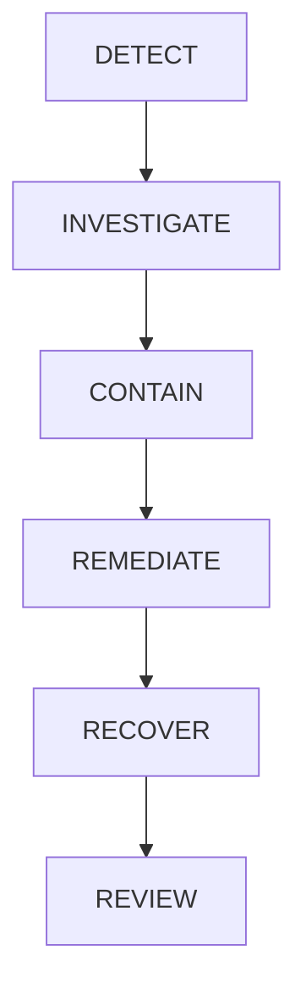

# Enterprise Security Architecture

<section class="kc-topic-hero" aria-label="Enterprise security architecture hero">
  

    Microsoft Security Reference Architecture
    <h2>Make risk visible across identity, endpoint, data and AI</h2>
    
Modern enterprise security requires an integrated platform approach. Identity, device, endpoint, email, data, AI and security operations controls should work as one architecture with measurable evidence, exception handling and response ownership.

    

      Identity
      Endpoint
      Data
      SOC
    

    

      <a class="kc-topic-button kc-topic-button--primary" href="/knowledge/security/conditional-access">Conditional Access</a>
      <a class="kc-topic-button" href="/knowledge/security/defender-xdr">Defender XDR</a>
      <a class="kc-topic-button" href="/knowledge/security/purview">Purview</a>
    

  

  

    

      Security Control Plane
      <strong>Zero Trust to operations</strong>
    

    

      <a href="#identity-security" class="kc-factory-card"><small>01</small><strong>Identity</strong>Entra ID, MFA, Conditional Access and risk-based policies.</a>
      <a href="#device-security" class="kc-factory-card"><small>02</small><strong>Device</strong>Intune compliance, configuration, application and platform controls.</a>
      <a href="#endpoint-protection" class="kc-factory-card"><small>03</small><strong>Defender</strong>Endpoint, email, XDR, vulnerability and incident response.</a>
      <a href="#data-protection" class="kc-factory-card"><small>04</small><strong>Purview</strong>Labels, DLP, audit, insider risk and Copilot data protection.</a>
    

    

      <strong>Architecture rule</strong>
      Security architecture should prove which risks are reduced, which controls enforce them and who operates the response when controls trigger.
    

  

</section>

## Executive Summary

Modern enterprise security requires an integrated platform approach rather than isolated security products.

Microsoft Security provides a unified architecture across Identity, Endpoint, Application, Data, AI, and Security Operations.

This document presents an enterprise security reference architecture used for Microsoft 365, Azure, Security, Copilot and AI transformation projects.

---

## Security Vision

## Business Objectives

Organizations must achieve:

- Secure Hybrid Work
- Zero Trust Security
- Data Protection
- Regulatory Compliance
- AI Governance
- Operational Resilience

---

## Security Reference Architecture

  

    Reference Architecture
    <strong>User access to detection and response</strong>
  

  

    
<small>01</small><strong>User</strong>Workforce, admin, guest, partner and service identities.

    
<small>02</small><strong>Entra ID</strong>Authentication, Conditional Access, identity governance and risk signals.

    
<small>03</small><strong>Intune</strong>Device compliance, configuration, app protection and platform baselines.

    
<small>04</small><strong>Defender & Purview</strong>Endpoint, email, data protection, DLP, audit and insider risk controls.

    
<small>05</small><strong>Copilot Security</strong>Permission boundary, data protection, prompt behavior and AI governance.

    
<small>06</small><strong>SOC</strong>Defender XDR, Sentinel, triage, incident response and evidence.

  

---

## Security Domains

| Domain | Platform |
|----------|----------|
| Identity | Microsoft Entra ID |
| Endpoint | Intune |
| Threat Protection | Microsoft Defender |
| Data Protection | Microsoft Purview |
| AI Security | Microsoft Copilot |
| Monitoring | Defender XDR |
| SIEM | Microsoft Sentinel |
| Access Control | Conditional Access |
| Network Access | Global Secure Access |

---

## Identity Security

Identity is the primary security perimeter.

---

## Core Services

### Microsoft Entra ID

Provides:

- Authentication
- Authorization
- SSO
- Identity Governance

---

## Key Controls

### MFA

Required

### Passwordless Authentication

Recommended

### Conditional Access

Required

### Risk-Based Policies

Required

---

## Device Security

## Microsoft Intune

Provides:

- Device Enrollment
- Configuration Management
- Compliance Validation
- Application Management

---

## Managed Device Requirements

Windows

- BitLocker
- Defender Active
- Current Patch Level

macOS

- Defender Active
- Encryption Enabled

Mobile

- Passcode
- Encryption
- Compliance Policy

---

## Endpoint Protection

## Microsoft Defender for Endpoint

Provides:

- EDR
- Vulnerability Management
- Threat Hunting
- Device Risk Assessment

---

## Security Objectives

Detect:

- Malware
- Ransomware
- Lateral Movement
- Credential Theft

Respond:

- Isolation
- Investigation
- Remediation

---

## Email Security

## Microsoft Defender for Office 365

Protects:

- Exchange Online
- Teams Links
- OneDrive Links
- SharePoint Links

---

## Security Features

- Safe Links
- Safe Attachments
- Anti-Phishing
- Impersonation Protection

---

## Data Protection

## Microsoft Purview

Protects enterprise information.

---

## Core Components

### Sensitivity Labels

Classification

### Encryption

Protection

### DLP

Prevention

### Insider Risk

Monitoring

### Audit

Investigation

---

## Information Classification Model

| Classification | Example |
|--------------|----------|
| Public | Marketing Content |
| Internal | Internal Documents |
| Confidential | Customer Data |
| Highly Confidential | Financial Data |

---

## Copilot Security Architecture

## Security Principle

Copilot does not create permissions.

Copilot uses existing permissions.

---

## Data Sources

- SharePoint Online
- OneDrive
- Teams
- Exchange Online
- Loop
- Microsoft Graph

---

## Security Controls

### Identity

- MFA
- Conditional Access

### Data

- Sensitivity Labels
- DLP

### Monitoring

- Audit
- Defender XDR

### Governance

- Copilot Readiness Assessment

---

## Copilot Risk Areas

### Oversharing

Cause:

Excessive Permissions

---

### Legacy SharePoint Access

Cause:

Historical Permission Design

---

### Sensitive Information Exposure

Cause:

Missing Classification

---

## Conditional Access Architecture

## Core Policies

### MFA

All Users

### Compliant Device

Microsoft 365 Access

### Risk Protection

High Risk Users

### Administrative Protection

Privileged Accounts

---

## Business Outcome

Verify every access request before granting access.

---

## Global Secure Access

## Purpose

Extend Zero Trust beyond traditional network boundaries.

---

## Use Cases

- Tenant Restriction
- Internet Access Control
- SaaS Access Control
- Microsoft Traffic Protection

---

## Integration

```mermaid
flowchart LR

USER --> GSA
GSA --> ENTRA
ENTRA --> M365
```

---

## Security Operations

## Microsoft Defender XDR

Correlates signals from:

- Identity
- Endpoint
- Email
- Data
- Cloud Apps

---

## Microsoft Sentinel

Provides:

- SIEM
- SOAR
- Threat Hunting
- Incident Management

---

## Incident Response Framework

```mermaid
flowchart TD

DETECT --> INVESTIGATE
INVESTIGATE --> CONTAIN
CONTAIN --> REMEDIATE
REMEDIATE --> RECOVER
RECOVER --> REVIEW
```

---

## Recommended Security Baseline

## Identity

- MFA
- Conditional Access
- PIM

---

## Endpoint

- Defender for Endpoint
- Intune Compliance

---

## Data

- Sensitivity Labels
- DLP

---

## AI

- Copilot Readiness
- Permission Review

---

## Monitoring

- Defender XDR
- Sentinel

---

## Security Maturity Model

| Level | Description |
|---------|---------|
| Level 1 | Basic Security |
| Level 2 | Managed Security |
| Level 3 | Zero Trust |
| Level 4 | Automated Response |
| Level 5 | AI-Driven Security |

---

## Key Metrics

| KPI | Target |
|---------|---------|
| MFA Adoption | 100% |
| Compliant Devices | >95% |
| DLP Coverage | 100% |
| Critical Alerts | Monitored |
| Copilot Readiness | Completed |

---

## Deliverables

- Security Assessment
- Security Architecture Design
- Conditional Access Matrix
- Intune Design
- Defender Design
- Purview Design
- Copilot Security Assessment
- Global Secure Access Design
- Security Operations Framework

---

## Related Documents

- Zero Trust Framework
- Conditional Access
- Defender for Endpoint
- Defender XDR
- Purview
- DLP
- Insider Risk
- Copilot Readiness

## 검색 키워드

- Microsoft security architecture
- Zero Trust
- Microsoft Defender
- Microsoft Purview
- Conditional Access
- Microsoft 365 보안
- 보안 아키텍처

## Contact / Asset Request

For security baseline workbooks, control matrices, exception registers, executive security reports or operations handover templates, use [Contact and Asset Request](../contact).
