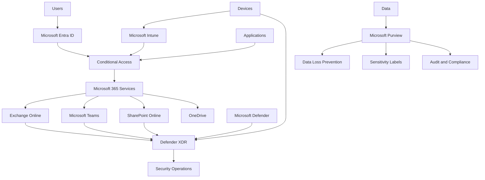
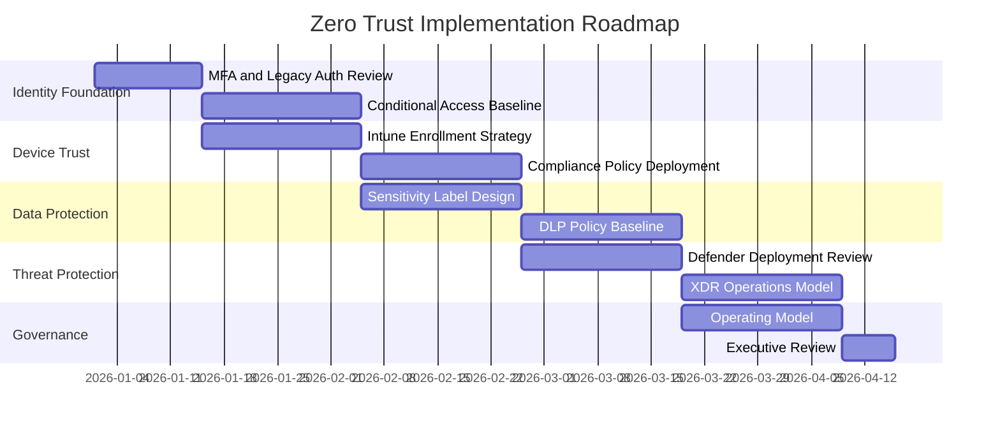

---
id: zero-trust-framework
title: Zero Trust Reference Architecture
sidebar_label: Zero Trust Framework
---

# Zero Trust Reference Architecture

## Executive Summary

Zero Trust is not a single product implementation.

It is an enterprise security architecture based on continuous verification, least privilege access, device trust, data protection and security monitoring.

For Microsoft cloud environments, Zero Trust should be designed across Microsoft Entra ID, Conditional Access, Intune, Defender, Purview and Microsoft 365 workloads.

---

## Zero Trust Principles

| Principle | Description |
|---|---|
| Verify Explicitly | Always authenticate and authorize based on available signals |
| Use Least Privilege | Limit user and administrator access to the minimum required |
| Assume Breach | Design detection, response and containment capabilities |

---

## Reference Architecture

---

## Architecture Domains

| Domain | Microsoft Capability | Purpose |
|---|---|---|
| Identity | Microsoft Entra ID | Authentication and authorization |
| Access | Conditional Access | Risk-based access control |
| Endpoint | Microsoft Intune | Device compliance and management |
| Threat Protection | Microsoft Defender | Detection and response |
| Data Protection | Microsoft Purview | Classification, DLP and compliance |
| Collaboration | Microsoft 365 | Secure productivity platform |
| Operations | Defender XDR / Sentinel | Monitoring and response |

---

## Identity Security

### Objectives

- Enforce strong authentication
- Reduce identity attack surface
- Protect privileged access
- Govern external identities
- Detect risky sign-ins

### Recommended Controls

| Control | Recommendation |
|---|---|
| MFA | Enforce MFA for all users |
| Conditional Access | Apply risk-based policies |
| PIM | Use just-in-time privileged access |
| Legacy Authentication | Block legacy authentication |
| Guest Access | Apply lifecycle and access review |

---

## Device Trust

### Objectives

- Allow access based on device health
- Enforce compliance policies
- Protect corporate data on endpoints
- Reduce unmanaged device exposure

### Recommended Controls

| Control | Recommendation |
|---|---|
| Intune Enrollment | Enroll corporate devices |
| Compliance Policy | Require compliant devices for sensitive access |
| Configuration Profile | Apply security baseline |
| Endpoint Protection | Deploy Defender for Endpoint |
| Mobile Access | Apply app protection where needed |

---

## Access Control

### Conditional Access Strategy

Conditional Access should evaluate:

- User identity
- Device compliance
- Location
- Application
- Sign-in risk
- User risk
- Session control

### Policy Baseline

| Policy | Recommendation |
|---|---|
| Block Legacy Authentication | Required |
| Require MFA for Admins | Required |
| Require MFA for All Users | Recommended |
| Require Compliant Device | Recommended for sensitive apps |
| Block High-Risk Sign-ins | Recommended |
| Session Control | Apply for unmanaged devices |

---

## Data Protection

### Objectives

- Classify sensitive information
- Prevent data leakage
- Control external sharing
- Support compliance requirements
- Protect information across Microsoft 365

### Recommended Controls

| Control | Recommendation |
|---|---|
| Sensitivity Labels | Define label taxonomy |
| DLP | Apply policies for sensitive data |
| Retention | Align with legal and business requirements |
| External Sharing | Restrict by sensitivity |
| Audit | Ensure audit visibility |

---

## Threat Protection

### Objectives

- Detect threats across email, endpoint, identity and cloud apps
- Correlate security incidents
- Support security operations
- Reduce response time

### Recommended Controls

| Area | Recommendation |
|---|---|
| Email | Defender for Office 365 |
| Endpoint | Defender for Endpoint |
| Identity | Entra ID risk signals |
| XDR | Defender XDR incident correlation |
| SIEM | Microsoft Sentinel where required |

---

## Zero Trust Maturity Model

| Level | Description |
|---|---|
| Level 1 | Basic identity and MFA controls |
| Level 2 | Conditional Access and device compliance |
| Level 3 | Defender and Purview integrated controls |
| Level 4 | XDR, automation and risk-based operations |
| Level 5 | Continuous optimization and governance |

---

## Implementation Roadmap

---

## Risk Register

| Risk | Impact | Mitigation |
|---|---|---|
| MFA not fully enforced | Account compromise risk | Apply staged MFA rollout |
| Legacy authentication enabled | Credential attack exposure | Block legacy authentication |
| Unmanaged devices allowed | Data leakage risk | Require compliant devices |
| Excessive SharePoint sharing | Oversharing exposure | Review external sharing and permissions |
| DLP not configured | Sensitive data leakage | Deploy priority DLP policies |
| No incident process | Slow response | Define security operations model |

---

## Executive Decision Points

Before implementing Zero Trust, leadership should confirm:

- Target security maturity level
- Required compliance controls
- Device management scope
- External sharing risk tolerance
- Security monitoring model
- Required licensing model
- Phased implementation timeline

---

## Recommended Deliverables

Zero Trust engagement should produce:

- Current State Security Assessment
- Zero Trust Gap Analysis
- Conditional Access Design
- Intune Compliance Baseline
- Defender Deployment Plan
- Purview and DLP Design
- Risk Register
- Executive Roadmap

---

## References

- Microsoft Zero Trust Guidance
- Microsoft Learn
- Microsoft Entra Documentation
- Microsoft Intune Documentation
- Microsoft Defender Documentation
- Microsoft Purview Documentation