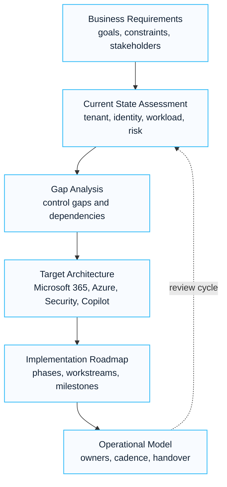

# Enterprise Architecture Builder

## Executive Summary

This architecture builder provides a standardized framework for designing Microsoft 365, Azure, Security and Copilot architectures.

The objective is to ensure consistency, scalability, security and operational excellence across consulting engagements.

---

## Architecture Design Methodology

---

## Business Requirements

### Business Drivers

Review:

- Digital transformation
- Security modernization
- Compliance requirements
- Cost optimization
- Collaboration improvement
- Copilot readiness

---

### Stakeholders

Identify:

- CIO
- CISO
- IT Director
- Infrastructure Team
- Security Team
- Compliance Team
- Business Owners

---

## Identity Architecture

### Components

- Microsoft Entra ID
- MFA
- Conditional Access
- Identity Governance
- PIM
- Self-Service Password Reset

### Design Questions

- Hybrid or cloud-only?
- MFA strategy?
- Guest access requirements?
- Administrative model?
- Identity lifecycle process?

---

## Collaboration Architecture

### Exchange Online

Review:

- Mailbox architecture
- Mail routing
- SMTP dependencies
- Hybrid requirements

---

### Microsoft Teams

Review:

- Teams lifecycle
- Guest access
- External access
- Meeting governance

---

### SharePoint Online

Review:

- Site architecture
- Permission model
- Information architecture
- External sharing

---

### OneDrive

Review:

- Storage model
- Sharing controls
- Retention requirements

---

## Security Architecture

### Identity Security

- MFA
- Conditional Access
- Identity Protection
- PIM

---

### Endpoint Security

- Intune
- Compliance Policies
- Configuration Profiles
- Device Management

---

### Threat Protection

- Defender for Endpoint
- Defender for Office 365
- Defender XDR
- Microsoft Sentinel

---

### Data Protection

- Purview
- Sensitivity Labels
- DLP
- Insider Risk

---

## Governance Architecture

### Governance Areas

| Area | Focus |
|---|---|
| Identity | Access governance |
| Collaboration | Teams and SharePoint governance |
| Security | Policy management |
| Compliance | Regulatory controls |
| Operations | Platform ownership |

---

## Copilot Architecture

### Foundation Requirements

- Entra ID
- SharePoint Online
- Teams
- Exchange Online

---

### Security Requirements

- Sensitivity Labels
- DLP
- Conditional Access
- Access Reviews

---

### Readiness Validation

- Permission review
- Data quality review
- Security validation
- Governance validation

---

## Azure Architecture

### Landing Zone Components

- Management Groups
- Subscriptions
- Resource Groups
- Networking
- Security Controls

---

### Governance Controls

- Azure Policy
- RBAC
- Cost Management
- Monitoring

---

## Migration Architecture

### Source Environment

Review:

- Identity
- Email
- Collaboration
- File Services
- Security

---

### Target Environment

Define:

- Target architecture
- Migration strategy
- Cutover model
- Hypercare model

---

## Operational Model

### Ownership Model

| Area | Owner |
|---|---|
| Identity | IAM Team |
| Security | Security Team |
| Collaboration | M365 Team |
| Azure | Cloud Team |
| Governance | IT Leadership |

---

## Deliverables

Architecture outputs should include:

- Current State Assessment
- Gap Analysis
- Target Architecture
- Governance Model
- Roadmap
- Risk Register
- Executive Summary

---

## Architecture Review Checklist

- Business requirements validated
- Security requirements validated
- Compliance requirements validated
- Governance model defined
- Operational ownership defined
- Risks documented
- Roadmap approved

---

## References

- Microsoft Cloud Adoption Framework
- Microsoft Well-Architected Framework
- Microsoft Learn
- Microsoft Security Adoption Framework

## 한국어 요약

Architecture Builder는 고객 요구사항을 Microsoft 365, Security, Copilot, Azure, Migration 관점의 target architecture로 바꾸기 위한 실무 도구입니다. 단순한 구성도 작성이 아니라 business requirement, security requirement, governance owner, risk, roadmap을 함께 정리하는 데 목적이 있습니다.

컨설팅에서는 이 문서를 사용해 current state, gap analysis, target state, decision log, risk register, executive summary를 일관된 구조로 만들 수 있습니다.

## 검색 키워드

- Microsoft architecture builder
- Microsoft 365 architecture template
- target architecture workshop
- architecture decision record
- Microsoft cloud architecture design
- Microsoft 아키텍처 설계
- Microsoft 365 아키텍처 템플릿

## Contact / Asset Request

For architecture workshop templates, decision logs, target architecture workbooks or executive architecture summary structures, use [Contact and Asset Request](../contact).
