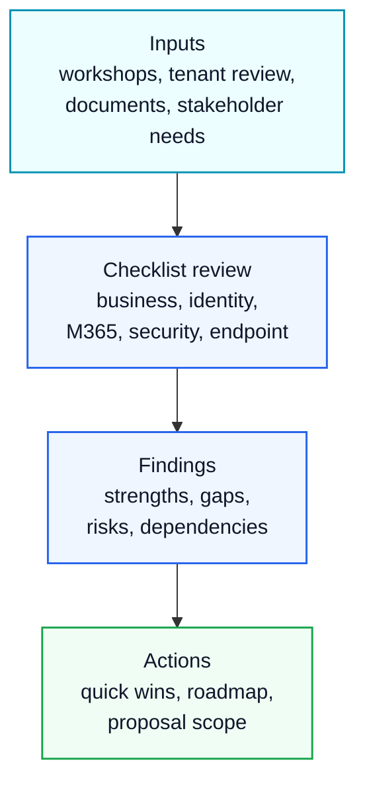

# Assessment Checklist

## Executive Summary

This checklist provides a standardized assessment structure for Microsoft 365, Azure, Security, Copilot and migration projects.

It is designed to support discovery workshops, current-state reviews, proposal preparation and consulting delivery planning.

---

## Assessment Categories

| Category | Review Area |
|---|---|
| Business | Objectives, stakeholders, priorities |
| Identity | Entra ID, MFA, Conditional Access |
| Microsoft 365 | Exchange, Teams, SharePoint, OneDrive |
| Security | Defender, Purview, DLP, Zero Trust |
| Endpoint | Intune, device compliance, endpoint protection |
| Migration | Source environment, target design, dependencies |
| Governance | ownership, policy, lifecycle, operations |

---

## Business Assessment

- Business objective confirmed
- Executive sponsor identified
- Key stakeholders identified
- Success criteria defined
- Timeline expectation confirmed
- Budget expectation confirmed
- Business risk identified

---

## Identity Assessment

- Entra ID tenant reviewed
- MFA status reviewed
- Conditional Access policies reviewed
- Legacy authentication status reviewed
- Privileged roles reviewed
- Guest users reviewed
- Access reviews configured

---

## Microsoft 365 Assessment

### Exchange Online

- Mailbox count reviewed
- Shared mailboxes reviewed
- Mail flow reviewed
- External forwarding reviewed
- Anti-spam policy reviewed

### Teams

- Teams creation policy reviewed
- Guest access reviewed
- External access reviewed
- Inactive Teams reviewed
- Ownerless Teams reviewed

### SharePoint and OneDrive

- Site structure reviewed
- External sharing reviewed
- Permission model reviewed
- Storage usage reviewed
- Sensitive content reviewed

---

## Security Assessment

- Secure Score reviewed
- Defender deployment reviewed
- Defender for Endpoint reviewed
- Defender for Office 365 reviewed
- Defender XDR reviewed
- Purview readiness reviewed
- DLP policies reviewed
- Sensitivity labels reviewed

---

## Endpoint Assessment

- Managed device inventory reviewed
- Windows device status reviewed
- macOS device status reviewed
- Mobile device status reviewed
- Intune enrollment reviewed
- Compliance policies reviewed
- Configuration profiles reviewed

---

## Migration Assessment

- Source platform identified
- User mapping reviewed
- Domain strategy reviewed
- Mailbox inventory reviewed
- File inventory reviewed
- Permission mapping reviewed
- Migration tool strategy reviewed
- Cutover risk reviewed

---

## Governance Assessment

- Platform ownership defined
- Security ownership defined
- Business ownership defined
- Change management process reviewed
- Lifecycle policy reviewed
- Exception process reviewed
- Reporting model reviewed

---

## Risk Classification

| Risk Level | Definition |
|---|---|
| Critical | Immediate action required |
| High | High business or security impact |
| Medium | Improvement required |
| Low | Optimization opportunity |

---

## Output

Assessment outputs should include:

- Current State Summary
- Risk Register
- Gap Analysis
- Licensing Recommendation
- Technical Roadmap
- Executive Summary
- Next Action Plan

---

## References

- Microsoft Cloud Adoption Framework
- Microsoft Well-Architected Framework
- Microsoft Security Adoption Framework
- Microsoft Learn

---

## 한국어 요약

이 문서는 Microsoft 365, Security, Endpoint, Migration, Governance 관점에서 assessment workshop을 준비하고 실행하기 위한 체크리스트입니다.

좋은 assessment는 단순한 현황 조사표가 아니라 executive summary, risk register, gap analysis, roadmap, licensing recommendation으로 이어져야 합니다. 특히 고객 환경에서는 tenant configuration, security control, adoption readiness, migration dependency를 함께 보아야 실제 제안서와 WBS로 연결됩니다.

## Assessment Output Model

| Output | Purpose |
|---|---|
| Current State Summary | 현재 tenant, security, device, migration 상태 요약 |
| Risk Register | 보안, 운영, 일정, 비용 리스크 분류 |
| Gap Analysis | 목표 상태와 현재 상태의 차이 |
| Roadmap | phase, owner, dependency, timeline 정의 |
| Executive Summary | 임원 보고용 핵심 메시지 |
| Next Action Plan | workshop 이후 실행 항목과 책임자 |

## Related Documents

- [M365 Assessment Workbook](../downloads/m365-assessment-workbook)
- [Assessment Framework](../proposal/assessment)
- [Architecture Builder](./architecture-builder)
- [Contact and Asset Request](../contact)

## Search Keywords

이 문서는 다음 검색 의도에 답합니다.

- Microsoft 365 assessment checklist
- M365 security assessment
- Microsoft 365 readiness assessment
- Copilot readiness checklist
- tenant assessment workbook
- Microsoft 365 진단 체크리스트
- 보안 진단 체크리스트
- Microsoft 365 컨설팅 assessment

## Contact / Asset Request

실제 workshop에서 사용할 editable assessment workbook, risk register, executive summary template이 필요하면 [Contact and Asset Request](../contact)를 통해 요청할 수 있습니다.
