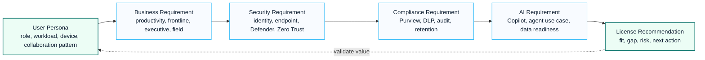

# Microsoft License Advisor

## Executive Summary

Microsoft licensing decisions should be aligned with business requirements, security objectives, compliance obligations and operational maturity.

This framework provides a structured approach for recommending Microsoft 365 licensing models.

---

## Licensing Decision Framework

---

## Microsoft 365 License Overview

| License | Target User |
|----------|----------|
| Business Basic | Email and collaboration |
| Business Standard | Office applications and collaboration |
| Business Premium | SMB security and device management |
| Microsoft 365 E3 | Enterprise productivity and compliance |
| Microsoft 365 E5 | Advanced security and compliance |
| Microsoft 365 F3 | Frontline workers |

---

## Business Basic

Recommended for:

- Email users
- Web Office users
- Small organizations
- Limited security requirements

Included capabilities:

- Exchange Online
- Teams
- SharePoint Online
- OneDrive

Not recommended when:

- Device management is required
- Advanced security is required
- Compliance requirements exist

---

## Business Standard

Recommended for:

- Knowledge workers
- Office application users
- Collaboration-focused organizations

Included capabilities:

- Desktop Office Apps
- Exchange Online
- Teams
- SharePoint
- OneDrive

Not recommended when:

- Security controls are required
- Intune is required
- Conditional Access strategy exists

---

## Business Premium

Recommended for:

- Small and medium businesses
- Security-first organizations
- Device management initiatives

Included capabilities:

- Intune
- Entra ID P1
- Conditional Access
- Defender for Business

Best fit:

- Up to 300 users
- Security modernization projects

---

## Microsoft 365 E3

Recommended for:

- Enterprise organizations
- Governance initiatives
- SharePoint modernization
- Hybrid environments

Included capabilities:

- Office Apps
- Exchange Online
- Teams
- SharePoint
- OneDrive
- Purview Core Capabilities

Typical use cases:

- Enterprise productivity
- Collaboration modernization
- Information governance

---

## Microsoft 365 E5

Recommended for:

- Security transformation
- Zero Trust programs
- Compliance initiatives
- SOC modernization

Included capabilities:

### Identity

- Entra ID P2
- PIM
- Identity Protection

### Security

- Defender for Endpoint
- Defender for Office 365
- Defender XDR

### Compliance

- Insider Risk Management
- Advanced eDiscovery
- Advanced Audit

### Analytics

- Power BI Pro

---

## Microsoft 365 F3

Recommended for:

- Frontline workers
- Manufacturing
- Logistics
- Retail
- Healthcare

Typical users:

- Store employees
- Factory operators
- Drivers
- Field workers

---

## Common Licensing Scenarios

### Scenario 1

Business Premium

Recommended when:

- Less than 300 users
- Intune required
- Conditional Access required

---

### Scenario 2

Microsoft 365 E3

Recommended when:

- Enterprise organization
- Information governance required
- SharePoint modernization planned

---

### Scenario 3

Microsoft 365 E5

Recommended when:

- Defender deployment planned
- Purview deployment planned
- Zero Trust implementation planned
- Compliance requirements exist

---

## Copilot Readiness

Recommended baseline:

| Scenario | Recommendation |
|-----------|-----------|
| Small Business | Business Premium |
| Enterprise | Microsoft 365 E3 |
| Secure Enterprise | Microsoft 365 E5 |

Copilot deployment should review:

- Identity security
- SharePoint permissions
- Data governance
- Sensitivity labels
- Access control

---

## Decision Matrix

| Requirement | Recommended License |
|---|---|
| Basic Collaboration | Business Basic |
| Desktop Apps | Business Standard |
| Security + Intune | Business Premium |
| Enterprise Productivity | Microsoft 365 E3 |
| Advanced Security | Microsoft 365 E5 |
| Frontline Workers | Microsoft 365 F3 |

---

## Assessment Questions

- Number of users?
- Frontline workers?
- Intune required?
- Conditional Access required?
- Defender deployment planned?
- Compliance requirements?
- Copilot roadmap?
- Global operations?

---

## References

- Microsoft Licensing Guide
- Microsoft Product Terms
- Microsoft Learn
- Microsoft 365 Service Descriptions

## 한국어 요약

License Advisor는 Microsoft 365, Security, Compliance, Copilot license를 단순 가격 비교가 아니라 기능 요구사항과 사용자 persona 기준으로 검토하기 위한 도구입니다.

실제 컨설팅에서는 user type, security requirement, Intune 필요 여부, Conditional Access, Defender, Purview, Copilot roadmap을 함께 검토해 license-to-capability map을 작성하는 데 활용합니다.

## 검색 키워드

- Microsoft 365 license advisor
- M365 E3 E5 comparison
- Business Premium licensing
- Copilot license readiness
- license to capability map
- Microsoft 365 라이선스 비교
- Copilot 라이선스 검토

## Contact / Asset Request

For license comparison workbooks, user persona matrices, capability maps or Copilot license readiness review templates, use [Contact and Asset Request](../contact).
