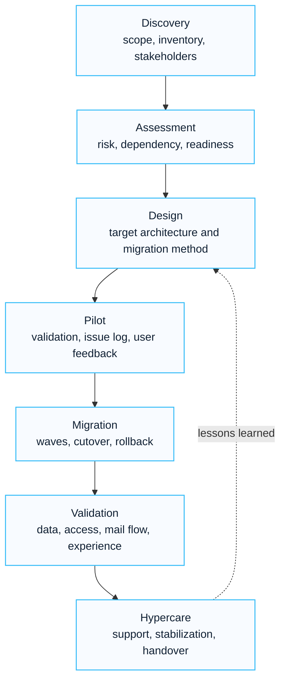

# Enterprise Migration Checklist

## Executive Summary

This checklist provides a standardized migration validation framework for Microsoft 365 transformation, tenant-to-tenant migration, Exchange Online migration, SharePoint migration and cloud modernization projects.

The objective is to reduce migration risk while ensuring business continuity and user productivity.

---

## Migration Lifecycle

---

## Discovery Checklist

### Business

- Business objectives documented
- Executive sponsor identified
- Stakeholders identified
- Timeline confirmed
- Budget confirmed
- Success criteria documented

---

### Technical

- Current environment documented
- Tenant inventory completed
- Domain inventory completed
- User inventory completed
- Application inventory completed
- Security inventory completed

---

## Assessment Checklist

### Identity

- Entra ID reviewed
- Active Directory reviewed
- Federation reviewed
- MFA reviewed
- Conditional Access reviewed
- Guest access reviewed

---

### Messaging

- Mailbox inventory completed
- Shared mailbox inventory completed
- Distribution group inventory completed
- SMTP relay inventory completed
- Mail flow dependencies reviewed

---

### Collaboration

- Teams inventory completed
- SharePoint inventory completed
- OneDrive inventory completed
- External sharing reviewed
- Permission model reviewed

---

## Design Checklist

### Target Architecture

- Identity architecture approved
- Security architecture approved
- Collaboration architecture approved
- Governance model approved
- Operational model approved

---

### Migration Strategy

- Migration tool selected
- Pilot strategy approved
- Cutover strategy approved
- Rollback strategy approved
- Hypercare strategy approved

---

## Domain Migration Checklist

- Domain inventory completed
- DNS dependencies identified
- Alias strategy reviewed
- SMTP strategy reviewed
- Domain transfer plan approved
- DNS cutover plan approved

---

## Exchange Online Migration Checklist

- Pilot mailboxes migrated
- Shared mailboxes validated
- Mail flow validated
- Mobile devices validated
- Outlook profiles validated
- Mail permissions validated

---

## SharePoint Migration Checklist

- Site inventory completed
- Permission review completed
- Metadata review completed
- Retention policy review completed
- Pilot migration completed
- User validation completed

---

## OneDrive Migration Checklist

- Storage inventory completed
- Ownership validated
- Sharing links reviewed
- Sensitive data reviewed
- Pilot migration completed
- User acceptance completed

---

## Teams Migration Checklist

- Team ownership validated
- Membership validated
- Guest access validated
- Channel access validated
- File access validated
- Meeting functionality validated

---

## Security Validation Checklist

### Identity Security

- MFA validated
- Conditional Access validated
- PIM validated
- Access reviews validated

---

### Data Protection

- Sensitivity labels validated
- DLP validated
- Retention policies validated
- Compliance controls validated

---

### Threat Protection

- Defender validated
- Security alerts validated
- Incident processes validated

---

## Pilot Migration Checklist

- Pilot users selected
- Migration completed
- User feedback collected
- Issues documented
- Lessons learned documented
- Go-live approval received

---

## Production Migration Checklist

### Before Migration

- Communication completed
- Support team prepared
- Backup confirmed
- Rollback plan approved

---

### During Migration

- Migration monitoring active
- Incident management active
- Escalation path active

---

### After Migration

- User validation completed
- Executive validation completed
- Technical validation completed
- Hypercare initiated

---

## Hypercare Checklist

- Support process active
- Ticket management active
- Executive support active
- Daily reporting active
- Knowledge transfer active

---

## Project Closure Checklist

- Migration completed
- Deliverables accepted
- Documentation completed
- Knowledge transfer completed
- Lessons learned documented
- Project closure approved

---

## Common Risks

| Risk | Mitigation |
|---|---|
| Incomplete discovery | Detailed assessment |
| Domain conflicts | Domain strategy review |
| Permission issues | Pilot validation |
| User resistance | Communication plan |
| Executive disruption | Dedicated migration wave |
| Application dependency issues | Dependency analysis |

---

## Deliverables

Migration projects should produce:

- Discovery Report
- Assessment Report
- Target Architecture
- Migration Runbook
- Cutover Plan
- Hypercare Plan
- Final Project Report

---

## References

- Microsoft Learn
- Microsoft Exchange Online Migration Guidance
- Microsoft SharePoint Migration Guidance
- Microsoft Entra Documentation
- Microsoft Cloud Adoption Framework

## 한국어 요약

Migration Checklist는 Exchange Online, Google Workspace, SharePoint, file server, tenant-to-tenant migration을 준비할 때 누락되기 쉬운 discovery, target design, pilot, cutover, rollback, hypercare 항목을 점검하기 위한 실무 체크리스트입니다.

성공적인 migration은 데이터 이동만으로 끝나지 않습니다. 사용자 커뮤니케이션, 보안 검증, batch planning, 관리자 인수인계, 운영 안정화까지 함께 준비해야 합니다.

## 검색 키워드

- Microsoft 365 migration checklist
- Exchange Online migration checklist
- SharePoint migration planning
- tenant migration runbook
- migration cutover checklist
- Microsoft 365 마이그레이션 체크리스트
- Exchange Online 전환 계획

## Contact / Asset Request

For migration pre-assessment checklists, cutover runbooks, rollback plans, wave planning sheets or hypercare trackers, use [Contact and Asset Request](../contact).
