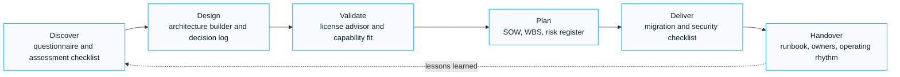

# Toolkit

The Toolkit section contains practical assets for assessment, architecture, migration, licensing, prompt design and delivery planning.

These tools are designed to support repeatable consulting work. They help convert field knowledge into consistent discovery, design, proposal and implementation outputs.

  <a class="kc-pathway-step" href="./assessment-checklist">
    <small>01</small>
    <strong>Assess</strong>
    Capture tenant, identity, security, endpoint, migration and governance readiness.
  </a>
  <a class="kc-pathway-step" href="./architecture-builder">
    <small>02</small>
    <strong>Design</strong>
    Convert business requirements into target architecture and decision records.
  </a>
  <a class="kc-pathway-step" href="./license-advisor">
    <small>03</small>
    <strong>Validate</strong>
    Map required capabilities to Microsoft 365, Security, Compliance and Copilot licenses.
  </a>
  <a class="kc-pathway-step" href="../proposal/overview">
    <small>04</small>
    <strong>Plan</strong>
    Shape SOW, WBS, risk register, timeline, assumptions and governance structure.
  </a>
  <a class="kc-pathway-step" href="../downloads/overview">
    <small>05</small>
    <strong>Request Assets</strong>
    Use public-safe descriptions and request editable templates when appropriate.
  </a>

## Visual Toolkit Flow

## 한국어 요약

Toolkit은 제안, 진단, 아키텍처 설계, migration, licensing, delivery planning을 반복 가능한 산출물로 만들기 위한 실무 도구 모음입니다.

고객에게 바로 공개하는 완성 문서가 아니라, workshop, assessment, SOW, WBS, risk register, architecture decision record를 빠르게 만들기 위한 컨설팅 운영 체계로 이해하면 됩니다.

## Toolkit Areas

| Tool | Purpose |
|---|---|
| Assessment Checklist | structure tenant, identity, security, collaboration and readiness assessment |
| Architecture Builder | translate business requirements into Microsoft cloud architecture decisions |
| License Advisor | compare Microsoft 365, security, compliance and Copilot licensing options |
| Migration Checklist | plan source discovery, target design, batching, cutover and hypercare |
| Prompt Library | reusable prompts for proposal, architecture, assessment and documentation |

## How To Use

1. Start with the assessment checklist to capture current state.
2. Use architecture builder to define target state and decision points.
3. Use license advisor to map required capabilities to license options.
4. Use migration checklist if workload movement or tenant consolidation is involved.
5. Use prompt library to accelerate repeatable documentation work.

## Consulting Workflow

| Phase | Toolkit Use | Output |
|---|---|---|
| Discover | Assessment Checklist, Discovery Questionnaire | current-state view, risk list, stakeholder questions |
| Design | Architecture Builder, License Advisor | target architecture, license decision, control model |
| Propose | SOW, WBS, Risk Register patterns | delivery scope, timeline, assumptions, exclusions |
| Deliver | Migration Checklist, Security Checklist | workstream plan, cutover plan, readiness evidence |
| Handover | Governance and operations templates | owner model, policy rhythm, support transition |

## Requestable Assets

The public pages explain the structure and recommended usage. Editable source files can be requested through the [Downloads Center](../downloads/overview) after confirming the intended scenario and confidentiality boundary.

Typical requestable assets include:

- Copilot readiness workbook
- Microsoft 365 assessment workbook
- security baseline checklist
- migration pre-assessment checklist
- SOW / WBS / Risk Register templates
- executive status and steering committee templates

## Recommended Reading

- [Assessment Checklist](./assessment-checklist)
- [Architecture Builder](./architecture-builder)
- [License Advisor](./license-advisor)
- [Migration Checklist](./migration-checklist)
- [Prompt Library](./prompt-library)
- [Downloads Center](../downloads/overview)

## Field-Informed Assets

This toolkit is informed by recurring enterprise delivery patterns:

- M365 deployment and policy workbook
- Copilot readiness and adoption WBS
- Exchange Online security review
- Entra ID and Intune implementation guides
- migration pre-assessment and cutover planning
- proposal SOW, WBS, risk and timeline structures

## 검색 키워드

- Microsoft 365 컨설팅 도구
- Microsoft 365 assessment checklist
- Copilot readiness workbook
- Microsoft 365 SOW template
- Microsoft 365 WBS template
- migration checklist
- security baseline checklist
- proposal asset library

## Contact / Asset Request

For editable assessment checklists, architecture workbooks, license advisor sheets, migration checklists or prompt library templates, use [Contact and Asset Request](../contact).
