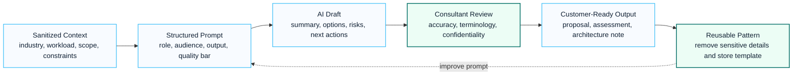

# Enterprise Prompt Library

## Executive Summary

This library contains reusable enterprise prompts designed for Microsoft consulting, architecture design, proposal development, security assessment and Copilot transformation engagements.

Prompts are intended to accelerate consulting delivery while maintaining consistent quality standards.

Use these prompts as structured starting points, not as final customer deliverables. A consultant should always add customer context, industry constraints, current-state findings, risk decisions and implementation assumptions before sharing the output externally. For Microsoft terminology, keep product names such as Microsoft 365, Entra ID, Intune, Defender, Purview and Copilot in English, while writing the surrounding explanation in natural Korean or concise business English depending on the audience.

## Visual Prompt Delivery Loop



## Prompt Quality Rules

- define the role, audience and expected output format before asking for analysis
- separate facts, assumptions, risks and recommendations
- ask for tables only when comparison or decision tracking is needed
- request executive summaries for leadership-facing outputs
- remove customer names, tenant IDs, commercial pricing and confidential architecture details before reusing prompts
- review generated content against Microsoft Learn and current customer requirements before publishing

## Recommended Review Flow

1. Draft the prompt with role, scope, audience and output structure.
2. Run the prompt with sanitized customer context.
3. Review technical accuracy, terminology and confidentiality.
4. Convert the response into a customer-ready deliverable.
5. Store reusable prompt patterns in this library only after removing sensitive details.

---

## Microsoft 365 Assessment Prompt

## Purpose

Current-state assessment and gap analysis.

## Prompt

```text
Act as a Microsoft 365 Enterprise Architect.

Review the current Microsoft 365 environment and provide:

1. Current State Assessment
2. Risk Analysis
3. Security Assessment
4. Licensing Assessment
5. Governance Assessment
6. Gap Analysis
7. Recommended Roadmap

Structure the output for CIO and IT leadership review.

Include Executive Summary, Findings, Risks, Recommendations and Next Actions.
```

---

## Executive Proposal Prompt

## Purpose

Executive proposal development.

## Prompt

```text
Act as a Senior Management Consultant from Microsoft Consulting, Accenture and McKinsey.

Create an executive proposal document.

Include:

Executive Summary
Business Drivers
Current Challenges
Target Architecture
Implementation Approach
Project Timeline
Deliverables
Risk Management
Expected Business Outcomes
Investment Justification

Target audience:

CIO
CISO
IT Director
Executive Leadership Team

Use executive-level language and consulting methodology.
```

---

## SOW Generation Prompt

## Purpose

Statement of Work creation.

## Prompt

```text
Act as a Microsoft Consulting Project Manager.

Create a professional Statement of Work.

Include:

Project Overview
Objectives
Scope
Deliverables
Assumptions
Dependencies
Out of Scope
Timeline
Roles and Responsibilities
Risk Management
Acceptance Criteria

The output should be customer-ready.
```

---

## WBS Generation Prompt

## Purpose

Work Breakdown Structure creation.

## Prompt

```text
Act as a Senior PMO Consultant.

Create a detailed Work Breakdown Structure.

Include:

Phase
Task
Subtask
Deliverable
Owner
Duration
Dependencies

Structure the WBS for enterprise consulting engagements.
```

---

## Microsoft 365 Copilot Strategy Prompt

## Purpose

Copilot readiness assessment.

## Prompt

```text
Act as a Microsoft Copilot Transformation Consultant.

Assess organizational readiness for Microsoft 365 Copilot.

Review:

Identity
Security
Governance
SharePoint
Teams
Information Architecture
Purview
User Adoption

Provide:

Current State
Readiness Score
Gap Analysis
Recommended Roadmap
Business Benefits
Risk Assessment

Target audience:

Executive Leadership Team
IT Leadership
Business Stakeholders
```

---

## Security Assessment Prompt

## Purpose

Security modernization assessment.

## Prompt

```text
Act as a Microsoft Security Architect.

Review the current security environment.

Assess:

Identity
Conditional Access
Defender
Purview
Endpoint Security
Data Protection
Compliance

Provide:

Current Security Posture
Risk Register
Gap Analysis
Recommended Controls
Zero Trust Roadmap
Implementation Priorities

Use Microsoft security best practices.
```

---

## Architecture Design Prompt

## Purpose

Target architecture design.

## Prompt

```text
Act as an Enterprise Architect.

Design a target-state architecture.

Include:

Business Requirements
Architecture Principles
Identity Architecture
Security Architecture
Collaboration Architecture
Governance Architecture
Operational Model

Provide diagrams and implementation guidance where applicable.
```

---

## Executive Briefing Prompt

## Purpose

Executive presentation preparation.

## Prompt

```text
Act as a Senior Executive Advisor.

Prepare an executive briefing document.

Include:

Executive Summary
Current Situation
Key Risks
Business Impact
Strategic Recommendations
Expected Outcomes
Decision Points

Target audience:

CEO
CIO
CISO
Executive Committee

Use concise executive language.
```

---

## Change Management Prompt

## Purpose

Adoption and change management planning.

## Prompt

```text
Act as an Organizational Change Management Consultant.

Create a Microsoft 365 adoption strategy.

Include:

Stakeholder Analysis
Communication Plan
Champion Program
Training Strategy
Support Model
Success Metrics
Governance Framework

Focus on user adoption and business value realization.
```

---

## Proposal Review Prompt

## Purpose

Quality assurance and proposal review.

## Prompt

```text
Act as a proposal review board.

Evaluate the proposal from:

Business Perspective
Technical Perspective
Financial Perspective
Executive Perspective

Identify:

Strengths
Weaknesses
Missing Elements
Risk Areas
Improvement Recommendations

Provide a final quality score from 1 to 100.
```

---

## References

- Microsoft Learn
- Microsoft Cloud Adoption Framework
- Microsoft Well-Architected Framework
- Microsoft Security Adoption Framework
- Microsoft Copilot Adoption Framework

## 검색 키워드

- Microsoft cloud architecture
- Microsoft 365 consulting
- enterprise governance
- consulting asset
- Microsoft 컨설팅
- 엔터프라이즈 아키텍처

## Contact / Asset Request

For editable templates, assessment workbooks, architecture summaries or delivery-ready consulting assets, use [Contact and Asset Request](../contact).
